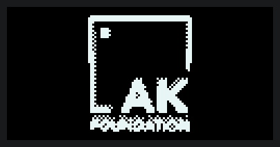
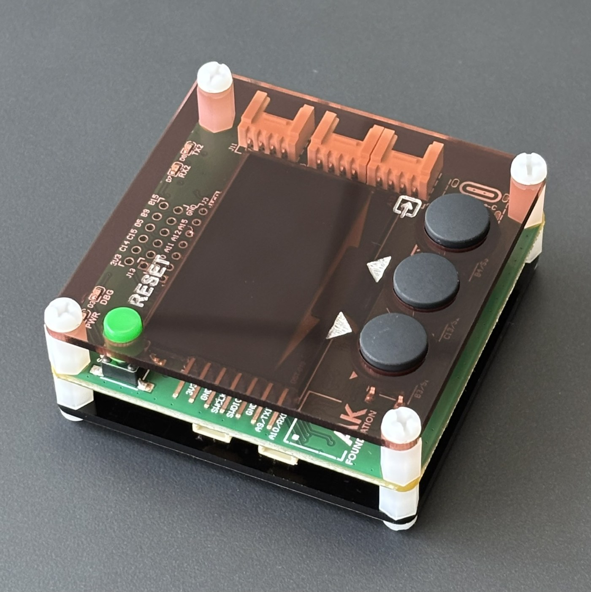
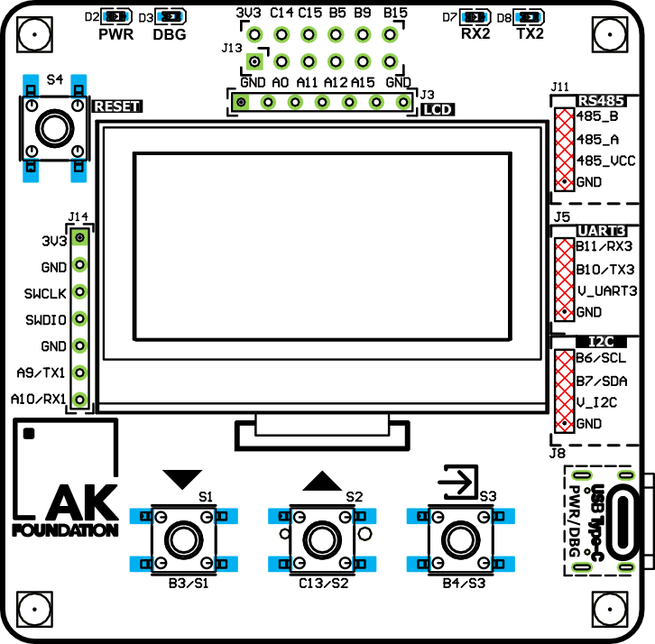
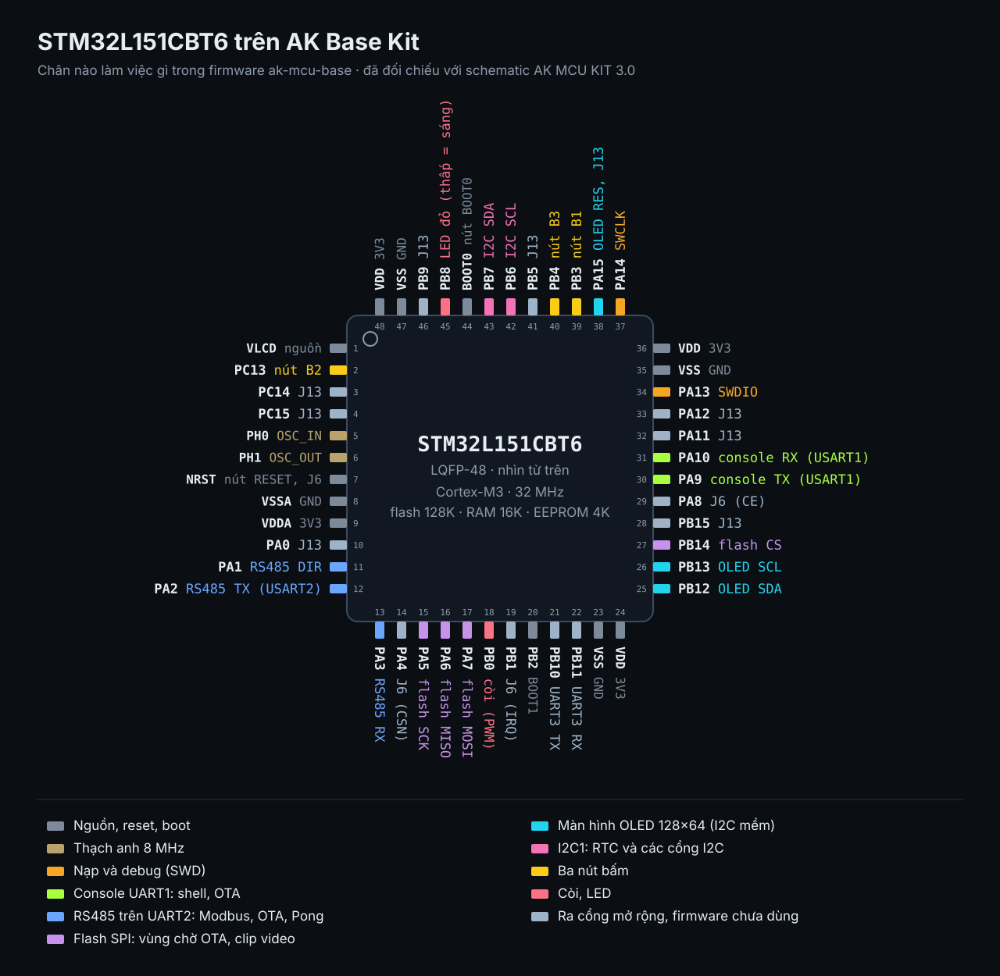

# ak-base-kit-pio — firmware source base for STM32L151

**English** · [Tiếng Việt](README.md)

<p align="center">
  <a href="https://hohoanganh.github.io/ak-base-kit-pio/play/"></a>
</p>

<p align="center">
  <a href="https://hohoanganh.github.io/ak-base-kit-pio/play/"></a>
  <a href="https://hohoanganh.github.io/ak-base-kit-pio/play/pong.html"></a>
</p>

A bare-metal firmware base for the **STM32L151CBT6** on the AK Base Kit: an event-driven kernel without an RTOS,
a bootloader, and firmware update over UART and RS485. Rebuilt from
[ak-base-kit-stm32l151](https://github.com/the-ak-foundation/ak-base-kit-stm32l151) by AK Foundation.

The pictures above are not photos. They are rendered by the firmware's own drawing code, and the link runs that same
C code in your browser as WebAssembly. No kit needed.

## The hardware

<p align="center">
  
  
</p>

STM32L151CBT6, a 1.54 inch 128×64 OLED, three buttons, a buzzer, a battery-backed RTC, a temperature and humidity
sensor, SPI flash, RS485, UART, I2C, USB Type-C. Photo and board drawing: [AK Foundation](https://github.com/the-ak-foundation/ak-base-kit-stm32l151/tree/main/hardware/images) (MIT licence).

<p align="center">
  
</p>

What each pin of the microcontroller does in the firmware (labels in Vietnamese: *nút* = button, *còi* = buzzer,
*chân cắm* = header pin). Generated by [`tools/pinout_svg.py`](ak-mcu-base/tools/pinout_svg.py).

## What is in it

| | |
|---|---|
| **Kernel** | Tasks talk through messages and run to completion: no RTOS, no races between tasks, little RAM |
| **Bootloader** | 8 KB. Checks the image before running it, installs updates, survives a power cut at any point (unit-tested at 1366 cut points) |
| **Update** | Over the UART console or Modbus RTU on RS485; images carry a CRC32 and the board name |
| **Crash log** | HardFault, fatal error, watchdog and stalled task are written to EEPROM and reported at the next start |
| **Modbus RTU** | Slave and master on top of nanoMODBUS (MIT) |
| **Demo** | 16 screens on a 128×64 OLED with three buttons: seven games, 3D, video from SPI flash, a weather station, a scope |
| **Tests** | Kernel, bootloader, update and every demo screen run on a PC under ASan; CI on every push |

## Two bases in this repository

- [`ak-mcu-base/`](ak-mcu-base/README.md) — **start new projects here.** Portable (the code above the HAL never includes
  a chip header), unit-tested, builds with PlatformIO or CMake. Current version: v1.3.4.
- [`sources/`](sources/) — the older base, kept for projects already running on it.

## Try it

```bash
# on the kit
cd ak-mcu-base && pio run -e demo -t upload

# or just the tests, on a PC
cmake -S ak-mcu-base -B build/host && cmake --build build/host -j && ctest --test-dir build/host
```

Firmware images: [Releases](https://github.com/hohoanganh/ak-base-kit-pio/releases).

## Documentation

Most of the documentation is in Vietnamese; the code and its comments are in English.

- [The demo, screen by screen](ak-mcu-base/docs/demo-kit.md) (Vietnamese)
- [What the new base changes](ak-mcu-base/docs/so-voi-base-cu.md) (Vietnamese)
- [Project page](https://hohoanganh.github.io/ak-base-kit-pio/) (Vietnamese)
- [Changelog](CHANGELOG.md) (Vietnamese)
