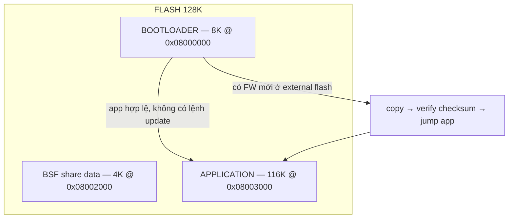
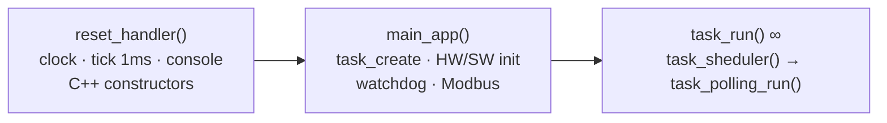

# ak-base-kit-pio — EPCB Firmware Source Base (STM32L151CBT6)

Source base phát triển firmware EPCB, dựng lại từ **ak-base-kit-stm32l151** (bản gốc build Makefile) theo mô hình PlatformIO đã chạy ổn định của **Smart-PDU-firmware**. Bare-metal, không dùng framework PlatformIO — SPL + CMSIS + startup + linker script nằm sẵn trong `sources/`.

**Vì sao dùng base này:** kernel AK Active Object không cần RTOS (RAM footprint nhỏ, task giao tiếp qua message, run-to-completion); bootloader + cập nhật firmware qua UART/external flash có sẵn; module bật/tắt bằng cờ biên dịch; kiến trúc phân lớp dễ port; build 1 lệnh, release tự động có version. Chi tiết: [docs/huong-dan-su-dung-source-base.md](docs/huong-dan-su-dung-source-base.md).

## Kiến trúc & bộ nhớ



```
┌──────────────────────────────────────────────────────────────────┐
│ APP TASKS   task_system · task_fw · task_shell · task_life ·     │
│             task_if · task_uart_if · task_dbg · task_display     │
├───────────────────────────────┬──────────────────────────────────┤
│ AK KERNEL   scheduler ·       │ NETWORKS/LIBS  mbmaster (Modbus) │
│ message · timer · fsm/tsm     │ net/link UART · ArduinoJson · QR │
├───────────────────────────────┼──────────────────────────────────┤
│ DRIVERS     button · buzzer · │ COMMON   xprintf · cmd_line ·    │
│ eeprom · flash · led · OLED   │ fifo / ring_buffer · view        │
├───────────────────────────────┴──────────────────────────────────┤
│ PLATFORM    startup/vector · io_cfg/sys_cfg · Arduino core ·     │
│             SPL StdPeriph + CMSIS · ak.ld                        │
├──────────────────────────────────────────────────────────────────┤
│ HW          STM32L151CBT6 (M3 · 32MHz · 128K/16K) + ext flash    │
└──────────────────────────────────────────────────────────────────┘
```

Luồng chạy application:



Sơ đồ đầy đủ (bootloader, kernel AK, timer, bảng ưu tiên task): [docs/ak-base-kit-pio-luong-hoat-dong.md](docs/ak-base-kit-pio-luong-hoat-dong.md) · bản đồ họa: [akbasekitpio.netlify.app](https://akbasekitpio.netlify.app/)

## Cấu trúc

```
ak-base-kit-pio/
├── platformio.ini            # cấu hình build: env app + env boot, module bật/tắt
├── boards/genericSTM32L151CB_bare.json
├── pio_build_flags.py        # cờ riêng C/C++ + cờ link (nostartfiles, nano.specs...)
├── pio_copy_release.py       # tự copy .bin/.elf về release/<env>/ sau khi build
├── release/                  # firmware thành phẩm (tự sinh, kèm version)
├── docs/                     # tài liệu luồng hoạt động + hướng dẫn sử dụng
└── sources/
    ├── application/          # firmware ứng dụng (AK kernel, task, driver, libs)
    │   ├── ak/               # kernel AK (fsm, tsm, task, timer, message)
    │   ├── app/              # task ứng dụng + screens  ← code dự án viết ở đây
    │   ├── common/           # utils, xprintf, cmd_line, container, view
    │   ├── driver/           # button, buzzer, eeprom, flash, gpio, led, OLED
    │   ├── libraries/        # ArduinoJson, nlohmann, QRCode
    │   ├── networks/         # net/link (UART link), mbmaster v2.9.6
    │   ├── platform/stm32l/  # io_cfg, sys_cfg, startup, SPL + CMSIS, ak.ld
    │   └── sys/
    └── boot/                 # bootloader 8K (cấu trúc tương tự, rút gọn)
```

## Build & nạp

```bash
pio run -e app                 # build firmware ứng dụng
pio run -e boot                # build bootloader
pio run -e boot -t upload      # nạp boot (board trắng phải nạp cả 2)
pio run -e app  -t upload      # nạp app (ST-Link)
pio device monitor             # console UART1 115200
```

Thành phẩm tự copy về `release/app/` và `release/boot/`, tên kèm version từ `-DAPP_VERSION`.

## Dùng cho dự án mới — 7 bước

1. **Copy** toàn bộ thư mục, đổi tên theo dự án; `git init`, commit mốc "clean base".
2. **Đổi định danh** trong `platformio.ini`: `-DAPP_TITLE`, `-DAPP_VERSION` (cả `[env:app]` lẫn `[env:boot]`), đổi tên `build_dir`; đổi prefix tên file trong `pio_copy_release.py`.
3. **Chọn module** bằng define trong `[env:app]`: `TASK_MBMASTER_EN`, `IF_LINK_UART_EN`, `SSD1309_DRIVER_EN`/`SH1106_DRIVER_EN`, `TASK_ZIGBEE_EN` (tắt), `IF_NETWORK_NRF24_EN` (tắt)... kèm `build_src_filter` tương ứng.
4. **Sửa phần cứng** theo schematic board mới: `sources/application/platform/stm32l/io_cfg.h/.c` (chân GPIO — chỗ sửa nhiều nhất), `sys_cfg.c` (clock, console).
5. **Build thử cả 2 env** — phải 0 lỗi trước khi viết code mới; nạp boot + app, xác nhận console lên log, LED life nháy.
6. **Viết chức năng mới** theo mô hình AK: thêm task ID vào `task_list.h` → đăng ký handler vào `task_list.cpp` → tạo `app/task_xxx.cpp` (tự vào build) → post message khởi động trong `main_app()`. Handler ngắn, không delay dài; giao tiếp giữa task chỉ qua `task_post_*`; chờ thì dùng `timer_set`.
7. **Release**: tăng `-DAPP_VERSION`, build, lấy file trong `release/` bàn giao.

Chi tiết từng bước + code mẫu task + nguyên tắc kernel AK + port MCU khác: [docs/huong-dan-su-dung-source-base.md](docs/huong-dan-su-dung-source-base.md)

## Ghi chú quan trọng

- **build_dir nằm ở %TEMP%** (xem `platformio.ini`): project trong OneDrive, build tại chỗ dễ bị khóa file `.o` gây lỗi "Permission denied" ngẫu nhiên.
- **`-Wl,-z,max-page-size=4 -Wl,--nmagic` trong `pio_build_flags.py` là bắt buộc.** `-t upload` nạp bằng openocd `program firmware.elf`, mà openocd đọc *program header* chứ không đọc section. Mặc định `ld` căn segment theo trang 64K nên segment của app (đặt tại 0x08003000) bị kéo `p_paddr` về 0x08000000 và nuốt thêm 12K rác ở đầu — nạp app sẽ ghi đè header ELF lên bootloader và xoá BSF, board chết ngay. Hai cờ này ép segment bắt đầu đúng 0x08003000.
- `task_zigbee.cpp` bị loại khỏi build (như bản gốc); muốn bật thêm `-DTASK_ZIGBEE_EN` và bỏ dòng loại trừ trong `build_src_filter`.
- Thư mục `doc/` nặng (~95MB PDF) và demo/tests/tools của mbmaster **không copy theo** — xem bản gốc tại `_reference/ak-base-kit-stm32l151-main`.
- Các file `Makefile.mk` còn trong `sources/` chỉ để tham khảo, PlatformIO không dùng.

## AI assistant — tài liệu kernel AK qua MCP

Repo có sẵn [.mcp.json](.mcp.json) tích hợp [mcp-docs-server](https://github.com/the-ak-foundation/mcp-docs-server)
của AK Foundation: Claude Code / Cursor mở repo này sẽ tự có tool tra API kernel AK,
guide viết task/driver, phân tích log UART. Cài đặt server trên máy mới + lưu ý phạm vi
tài liệu: [docs/ak-mcp-docs-server.md](docs/ak-mcp-docs-server.md).

## Nguồn gốc

- Base: `_reference/ak-base-kit-stm32l151-main` (AK Embedded Base Kit, GaoKong)
- Mô hình PlatformIO: `_reference/Smart-PDU-firmware`

---

*EPCB Vietnam · contact@epcb.vn · (+84) 367 939 867 · www.epcb.vn*
