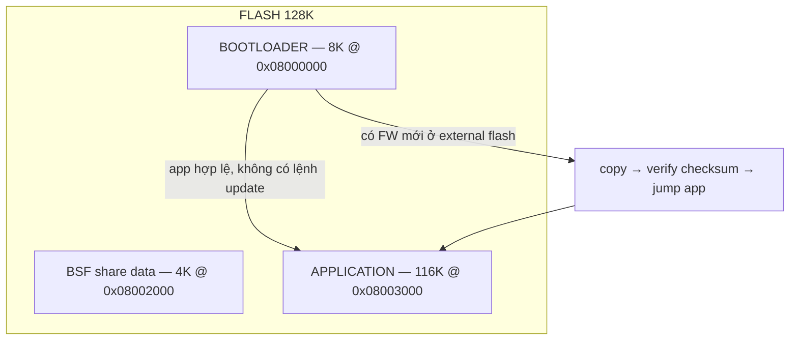
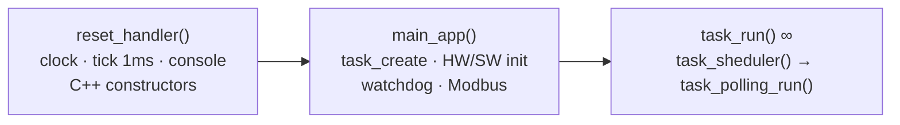

# ak-base-kit-pio — Firmware Source Base (STM32L151CBT6)

Source base phát triển firmware STM32L151, dựng lại từ
[**ak-base-kit-stm32l151**](https://github.com/the-ak-foundation/ak-base-kit-stm32l151) (bản gốc build
bằng Makefile) theo mô hình PlatformIO đã chạy ổn định của dự án Smart-PDU. Bare-metal, không dùng
framework PlatformIO — SPL + CMSIS + startup + linker script nằm sẵn trong `sources/`.

**Vì sao dùng base này:** kernel AK Active Object không cần RTOS (RAM footprint nhỏ, task giao tiếp
qua message, run-to-completion); bootloader + cập nhật firmware qua UART/external flash có sẵn; module
bật/tắt bằng cờ biên dịch; kiến trúc phân lớp dễ port; build 1 lệnh, release tự động có version.
Chi tiết: [docs/huong-dan-su-dung-source-base.md](docs/huong-dan-su-dung-source-base.md).

**Phiên bản mới nhất: `v1.1.2`** — lịch sử thay đổi: [CHANGELOG.md](CHANGELOG.md) · lỗi đã biết và
bản sửa: [docs/known-bugs.md](docs/known-bugs.md).

## Kiến trúc & bộ nhớ



```
┌──────────────────────────────────────────────────────────────────┐
│ APP TASKS   task_system · task_fw · task_shell · task_life ·     │
│             task_if · task_uart_if · task_dbg · task_display     │
├───────────────────────────────┬──────────────────────────────────┤
│ AK KERNEL   scheduler ·       │ NETWORKS/LIBS  mbmaster (Modbus) │
│ message · timer · fsm/tsm     │ net/link UART · ArduinoJson · QR │
├───────────────────────────────┼──────────────────────────────────┤
│ DRIVERS     button · buzzer · │ COMMON   xprintf · cmd_line ·    │
│ eeprom · flash · led · OLED   │ fifo / ring_buffer · view        │
├───────────────────────────────┴──────────────────────────────────┤
│ PLATFORM    startup/vector · io_cfg/sys_cfg · Arduino core ·     │
│             SPL StdPeriph + CMSIS · ak.ld                        │
├──────────────────────────────────────────────────────────────────┤
│ HW          STM32L151CBT6 (M3 · 32MHz · 128K/16K) + ext flash    │
└──────────────────────────────────────────────────────────────────┘
```

Luồng chạy application:



Sơ đồ đầy đủ (bootloader, kernel AK, timer, bảng ưu tiên task):
[docs/ak-base-kit-pio-luong-hoat-dong.md](docs/ak-base-kit-pio-luong-hoat-dong.md).

## Cấu trúc

```
ak-base-kit-pio/
├── platformio.ini            # cấu hình build: env app + env boot, module bật/tắt
├── boards/genericSTM32L151CB_bare.json
├── pio_build_flags.py        # cờ riêng C/C++ + cờ link (nostartfiles, nano.specs...)
├── pio_copy_release.py       # tự copy .bin/.elf về release/<env>/ sau khi build
├── pio_bsf.py                # target `-t bsf`: nạp BSF mẫu (chỉ cần với bootloader < 0.0.2)
├── .mcp.json                 # MCP server tra tài liệu kernel AK cho AI assistant
├── CHANGELOG.md              # lịch sử phiên bản
├── release/                  # firmware thành phẩm (tự sinh, kèm version)
├── docs/                     # luồng hoạt động · hướng dẫn · lỗi đã biết · MCP
└── sources/
    ├── application/          # firmware ứng dụng (AK kernel, task, driver, libs)
    │   ├── ak/               # kernel AK (fsm, tsm, task, timer, message)
    │   ├── app/              # task ứng dụng + screens  ← code dự án viết ở đây
    │   ├── common/           # utils, xprintf, cmd_line, container, view
    │   ├── driver/           # button, buzzer, eeprom, flash, gpio, led, OLED
    │   ├── libraries/        # ArduinoJson, nlohmann, QRCode
    │   ├── networks/         # net/link (UART link), mbmaster v2.9.6
    │   ├── platform/stm32l/  # io_cfg, sys_cfg, startup, SPL + CMSIS, ak.ld
    │   └── sys/
    └── boot/                 # bootloader 8K (cấu trúc tương tự, rút gọn)
```

## Build & nạp

```bash
pio run -e app                 # build firmware ứng dụng
pio run -e boot                # build bootloader
pio run -e boot -t upload      # 1. nạp boot (board trắng phải nạp cả 2)
pio run -e app  -t upload      # 2. nạp app (ST-Link)
pio run -e app  -t bsf         # 3. nạp BSF mẫu — chỉ cần với bootloader cũ (< 0.0.2)
pio device monitor             # console UART1 115200
```

Thành phẩm tự copy về `release/app/` và `release/boot/`, tên kèm version từ `-DAPP_VERSION`.
Mỗi env có giới hạn flash riêng (`board_upload.maximum_size`: app 116K, boot 8K) — vượt là build báo
lỗi ngay, không để bootloader lấn sang BSF.

**Bước 3 không còn bắt buộc từ bootloader 0.0.2 (base v1.1.0).** Bootloader tự kiểm bảng vector của
app; BSF (`0x08002000`) chưa ai ghi hoặc bị xoá giữa chừng thì nó tự vá rồi chạy app. Board còn mang
bootloader cũ thì vẫn phải chạy `-t bsf` — thiếu bước này boot rơi vào nhánh "unexpected status" và
đứng ở `while(1)` nhấp nháy LED, nhìn từ ngoài giống hệt board treo. Chi tiết:
[docs/known-bugs.md](docs/known-bugs.md) #3.

## Dùng cho dự án mới — 7 bước

1. **Clone theo tag mới nhất** (`git clone --depth 1 --branch v1.1.2 ...`), xoá `.git`, `git init`,
   ghi "Khởi tạo từ ak-base-kit-pio v1.1.2" vào README dự án, commit mốc "clean base". **Không** chép
   thư mục tay hay chép nền từ một dự án khác — mất dấu bản base là mất dấu các bản sửa.
2. **Đổi định danh** trong `platformio.ini`: `-DAPP_TITLE`, `-DAPP_VERSION` (cả `[env:app]` lẫn
   `[env:boot]`), đổi tên `build_dir`; đổi prefix tên file trong `pio_copy_release.py`.
3. **Chọn module** bằng define trong `[env:app]`: `TASK_MBMASTER_EN`, `SERIAL2_EN`, `IF_LINK_UART_EN`,
   `SSD1309_DRIVER_EN`/`SH1106_DRIVER_EN`, `TASK_ZIGBEE_EN` (tắt), `IF_NETWORK_NRF24_EN` (tắt)... kèm
   `build_src_filter` tương ứng. USART2 chỉ có **một chủ**: `TASK_MBMASTER_EN` hoặc `SERIAL2_EN`, bật
   cả hai là lỗi biên dịch.
4. **Sửa phần cứng** theo schematic board mới: `sources/application/platform/stm32l/io_cfg.h/.c` (chân
   GPIO — chỗ sửa nhiều nhất), `sys_cfg.c` (clock, console). Struct cấu hình SPL luôn qua
   `XXX_StructInit()` trước khi gán.
5. **Build thử cả 2 env** — phải 0 lỗi, 0 cảnh báo trước khi viết code mới; nạp boot + app, xác nhận
   console lên log, LED life nháy.
6. **Viết chức năng mới** theo mô hình AK: thêm task ID vào `task_list.h` → thêm dòng vào
   `app_task_table` trong `task_list.cpp` **đúng vị trí tương ứng** → tạo `app/task_xxx.cpp` (tự vào
   build) → post message khởi động trong `main_app()`. Kernel tra task bằng chỉ số
   `task_table[task_id]`, nên thứ tự dòng phải khớp thứ tự enum — lệch là `FATAL("TK", 0x08)` ngay
   lúc khởi động.
7. **Release**: tăng `-DAPP_VERSION`, build, lấy file trong `release/` bàn giao.

Chi tiết từng bước + code mẫu task + nguyên tắc kernel AK + port MCU khác:
[docs/huong-dan-su-dung-source-base.md](docs/huong-dan-su-dung-source-base.md).

## Ghi chú quan trọng

- **Lỗi đã biết — đã sửa hết trong v1.1.2:** [docs/known-bugs.md](docs/known-bugs.md). Dự án tạo từ
  bản cũ hơn còn mang các lỗi nghiêm trọng: `HardwareSerial::write()` kẹt ring TX (giết RS485 bán
  song công), bootloader kẹt ở "uart boot" khi BSF bị xoá giữa chừng, và `io_cfg_adc1()` nạp rác vào
  ADC làm kênh ngoài đọc ra 0 — xem file đó để chép bản sửa sang.
- **`build_dir` nằm ở `%TEMP%`** (xem `platformio.ini`): project trong OneDrive, build tại chỗ dễ bị
  khóa file `.o` gây lỗi "Permission denied" ngẫu nhiên.
- **`-Wl,-z,max-page-size=4 -Wl,--nmagic` trong `pio_build_flags.py` là bắt buộc.** `-t upload` nạp
  bằng openocd `program firmware.elf`, mà openocd đọc *program header* chứ không đọc section. Mặc định
  `ld` căn segment theo trang 64K nên segment của app (đặt tại `0x08003000`) bị kéo `p_paddr` về
  `0x08000000` và nuốt thêm 12K rác ở đầu — nạp app sẽ ghi đè header ELF lên bootloader và xoá BSF,
  board chết ngay. Hai cờ này ép segment bắt đầu đúng `0x08003000`.
- **`pio run` ghi đè file trong `release/`** cùng tên version. Build thử thì tăng version hoặc
  `git checkout -- release` sau khi build, đừng commit nhầm bản build thử.
- `task_zigbee.cpp` bị loại khỏi build (như bản gốc); muốn bật thêm `-DTASK_ZIGBEE_EN` và bỏ dòng loại
  trừ trong `build_src_filter`. Zigbee tự bật `SERIAL2_EN`, nên phải tắt `TASK_MBMASTER_EN`.
- Thư mục `doc/` nặng (~95MB PDF) và demo/tests/tools của mbmaster **không copy theo** — xem ở
  [repo gốc](https://github.com/the-ak-foundation/ak-base-kit-stm32l151).
- Các file `Makefile.mk` còn trong `sources/` chỉ để tham khảo, PlatformIO không dùng.

## AI assistant — tài liệu kernel AK qua MCP

Repo có sẵn [.mcp.json](.mcp.json) tích hợp [mcp-docs-server](https://github.com/the-ak-foundation/mcp-docs-server)
của AK Foundation: Claude Code / Cursor mở repo này sẽ tự có tool tra API kernel AK, guide viết
task/driver, phân tích log UART. Cài đặt server trên máy mới + lưu ý phạm vi tài liệu:
[docs/ak-mcp-docs-server.md](docs/ak-mcp-docs-server.md).

## Nguồn gốc

- Base: [the-ak-foundation/ak-base-kit-stm32l151](https://github.com/the-ak-foundation/ak-base-kit-stm32l151)
  (AK Embedded Base Kit, GaoKong) — bản build Makefile.
- Mô hình PlatformIO (build_dir ngoài repo, script cờ biên dịch, tự copy release): dự án Smart-PDU
  (không công khai).
