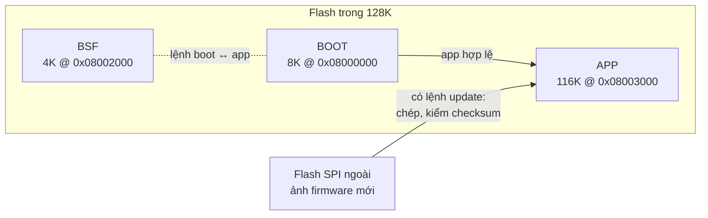

# ak-base-kit-pio — Firmware source base cho STM32L151

**Tiếng Việt** · [English](README.en.md)

<p align="center">
  <a href="https://hohoanganh.github.io/ak-base-kit-pio/play/"></a>
</p>

<p align="center">
  <a href="https://hohoanganh.github.io/ak-base-kit-pio/play/"></a>
  <a href="https://hohoanganh.github.io/ak-base-kit-pio/play/pong.html"></a>
</p>

<p align="center">
  <a href="https://github.com/hohoanganh/ak-base-kit-pio/actions/workflows/ak-mcu-base.yml"></a>
  
</p>

Nền firmware bare-metal cho **STM32L151CBT6** (AK Base Kit): kernel AK hướng sự kiện không cần RTOS, bootloader,
cập nhật firmware qua UART và RS485. Dựng lại từ
[ak-base-kit-stm32l151](https://github.com/the-ak-foundation/ak-base-kit-stm32l151) của AK Foundation.

Ảnh động ở trên **không phải ảnh chụp**: nó được dựng từ chính mã vẽ của firmware. Và hai nút bên dưới nó chạy đúng mã C
đó trong trình duyệt, không cần kit.

| Muốn… | Vào đây |
|---|---|
| **Xem nó chạy** | [Một kit, đủ 16 màn hình](https://hohoanganh.github.io/ak-base-kit-pio/play/) · [hai kit chơi Pong với nhau](https://hohoanganh.github.io/ak-base-kit-pio/play/pong.html) |
| **Biết demo có gì** | [Từng màn hình, kèm ảnh động](ak-mcu-base/docs/demo-kit.md) |
| **Bắt đầu dự án mới** | `python ak-mcu-base/tools/new_project.py <thư-mục> --board <tên-board>` · [hướng dẫn](ak-mcu-base/docs/tien-ich.md) |
| **Tải firmware** | [Releases](https://github.com/hohoanganh/ak-base-kit-pio/releases) |
| **Đọc tổng quan** | [Trang giới thiệu](https://hohoanganh.github.io/ak-base-kit-pio/) |

## Phần cứng: AK Base Kit

<p align="center">
  
  
</p>

STM32L151CBT6, màn hình OLED 1,54 inch 128×64, ba nút bấm, còi, RTC có pin, flash SPI 1 MB, RS485, UART, I2C,
USB Type-C có sẵn mạch USB–UART. Ảnh và sơ đồ bo: [AK Foundation](https://github.com/the-ak-foundation/ak-base-kit-stm32l151/tree/main/hardware/images) (giấy phép MIT).

### Trên bo có gì

<p align="center">
  
</p>

### Chân nào làm việc gì

<p align="center">
  
</p>

Sơ đồ đã đối chiếu với schematic AK MCU KIT 3.0 và khớp với cấu hình chân trong firmware
(`ak-mcu-base/port/stm32l151`). Sinh bởi [`tools/pinout_svg.py`](ak-mcu-base/tools/pinout_svg.py).

### Các cổng nối

<p align="center">
  
</p>

Theo schematic AK MCU KIT 3.0, sinh bởi [`tools/connectors_svg.py`](ak-mcu-base/tools/connectors_svg.py).
Bảng chân dạng chữ: [demo-kit.md](ak-mcu-base/docs/demo-kit.md#phần-cứng-ak-base-kit-3i0).

### Cây nguồn

<p align="center">
  
</p>

## Phần mềm: một mã nguồn, ba nơi chạy

<p align="center">
  
</p>

Sơ đồ bộ nhớ, luồng cập nhật firmware và cách demo chạy trên kernel: xem [ak-mcu-base/README.md](ak-mcu-base/README.md)
và [tài liệu demo](ak-mcu-base/docs/demo-kit.md).

## Repo có hai base — chọn cái nào

| | [`sources/`](sources/) — base cũ | [`ak-mcu-base/`](ak-mcu-base/README.md) — base cho dự án mới |
|---|---|---|
| Phiên bản | **v1.3.0**, bootloader 0.0.3 | **v1.3.6**, bootloader 1.2.0 |
| Dùng khi | Dự án đang chạy trên nó; cần driver có sẵn (EEPROM ngoài, nRF24, lớp Arduino…) | Dự án mới: OTA an toàn khi mất điện, có unit test, dễ chuyển sang chip khác |
| Mức hoàn thiện | Đầy đủ, đã dùng cho sản phẩm | Kernel, bootloader, OTA, Modbus RTU, nhật ký sự cố, demo trên kit; driver khác tự viết thêm |
| Build | PlatformIO | PlatformIO hoặc CMake |
| Cập nhật firmware | UART, RS485 (Modbus), flash SPI ngoài | UART và RS485 (Modbus); ảnh có CRC32, tên board, chống cài dở |
| Kiểm thử trên máy tính | Lớp Modbus | Kernel, bootloader, Modbus, OTA đầu-cuối trên giả lập, màn hình demo |

So sánh chi tiết, kèm những gì base mới còn thiếu: **[xem trang so sánh](https://hohoanganh.github.io/ak-base-kit-pio/ak-mcu-base-so-voi-base-cu.html)** · bản Markdown: [ak-mcu-base/docs/so-voi-base-cu.md](ak-mcu-base/docs/so-voi-base-cu.md).

Phần còn lại của trang này nói về base `sources/`, dành cho các dự án đang chạy trên nó.

## Bộ nhớ và kiến trúc


```mermaid
flowchart LR
    subgraph FLASH["Flash trong 128K"]
        B["BOOT<br>8K @ 0x08000000"]
        S["BSF<br>4K @ 0x08002000"]
        A["APP<br>116K @ 0x08003000"]
    end
    X["Flash SPI ngoài<br>ảnh firmware mới"]
    B -- "app hợp lệ" --> A
    X -- "có lệnh update:<br>chép, kiểm checksum" --> A
    S -. "lệnh boot ↔ app" .- B
```

```
┌──────────────────────────────────────────────────────────────────┐
│ APP TASKS   task_system · task_fw · task_shell · task_life ·     │
│             task_if · task_uart_if · task_dbg · task_display     │
├───────────────────────────────┬──────────────────────────────────┤
│ AK KERNEL   scheduler ·       │ NETWORKS/LIBS  nanoMODBUS        │
│ message · timer · fsm/tsm     │ net/link UART · ArduinoJson · QR │
├───────────────────────────────┼──────────────────────────────────┤
│ DRIVERS     button · buzzer · │ COMMON   xprintf · cmd_line ·    │
│ eeprom · flash · led · OLED   │ fifo / ring_buffer · view        │
├───────────────────────────────┴──────────────────────────────────┤
│ PLATFORM    startup/vector · io_cfg/sys_cfg · Arduino core ·     │
│             SPL StdPeriph + CMSIS · ak.ld                        │
├──────────────────────────────────────────────────────────────────┤
│ HW          STM32L151CBT6 (M3 · 32MHz · 128K/16K) + ext flash    │
└──────────────────────────────────────────────────────────────────┘
```

Luồng chạy đầy đủ (bootloader, kernel, timer, bảng ưu tiên task):
[docs/ak-base-kit-pio-luong-hoat-dong.md](docs/ak-base-kit-pio-luong-hoat-dong.md).

## Bắt đầu nhanh

Cần PlatformIO và ST-Link. Board trắng phải nạp cả boot lẫn app.

```bash
pio run -e boot -t upload      # 1. bootloader
pio run -e app  -t upload      # 2. app (Modbus master, mặc định)
pio device monitor             # console UART1, 115200
```

Biến thể Modbus slave để cập nhật qua RS485: `pio run -e app_mbslave`.
File `.bin` thành phẩm nằm ở `release/`; `.bin` và `.elf` của mọi bản tải ở
[Releases](https://github.com/hohoanganh/ak-base-kit-pio/releases).

## Tôi muốn…

| Việc | Đọc |
|---|---|
| Tạo dự án mới từ base này | [docs/bat-dau-du-an-moi.md](docs/bat-dau-du-an-moi.md) — 7 bước, build, phát hành, các bẫy |
| Hiểu kernel AK, viết task, port chip khác | [docs/huong-dan-su-dung-source-base.md](docs/huong-dan-su-dung-source-base.md) |
| Cập nhật firmware qua RS485, không cần ST-Link | [docs/ota-rs485.md](docs/ota-rs485.md) — bảng thanh ghi, lệnh, tool có giao diện |
| Biết bản nào sửa lỗi gì | [CHANGELOG.md](CHANGELOG.md) · [docs/known-bugs.md](docs/known-bugs.md) |
| Xem tính năng Modbus mới (v1.2 – v1.3) | [docs/tinh-nang-moi-v1.2-v1.3.md](docs/tinh-nang-moi-v1.2-v1.3.md) |
| Dùng base mới `ak-mcu-base` | [ak-mcu-base/README.md](ak-mcu-base/README.md) |
| Cho AI assistant tra tài liệu kernel AK | [docs/ak-mcp-docs-server.md](docs/ak-mcp-docs-server.md) — repo có sẵn [.mcp.json](.mcp.json) |

## Ba điều dễ dính nhất

1. **Dự án mới phải clone theo tag** (`git clone --depth 1 --branch v1.3.0 …`) và ghi version base vào README
   của dự án. Chép tay từ một dự án khác là mất dấu các bản sửa lỗi.
2. **`pio run` ghi đè file cùng version trong `release/`.** Build thử thì tăng version, hoặc
   `git checkout -- release` sau khi build.
3. **Board mang bootloader cũ hơn 0.0.2** phải nạp thêm BSF (`pio run -e app -t bsf`). Thiếu bước này board
   đứng ở vòng chờ nháy LED, nhìn giống hệt board treo.

Các ghi chú còn lại (cờ link bắt buộc, `build_dir` ngoài OneDrive, Zigbee, test host…):
[docs/bat-dau-du-an-moi.md](docs/bat-dau-du-an-moi.md#3-ghi-chú-quan-trọng).

## Cấu trúc thư mục

```
ak-base-kit-pio/
├── sources/
│   ├── application/      firmware ứng dụng
│   │   ├── ak/           kernel AK
│   │   ├── app/          task của dự án  ← viết code ở đây
│   │   ├── driver/       button, buzzer, eeprom, flash, led, OLED
│   │   ├── networks/     net/link UART, nanoMODBUS
│   │   └── platform/     io_cfg, sys_cfg, startup, SPL + CMSIS, ak.ld
│   └── boot/             bootloader 8K
├── ak-mcu-base/          base mới, độc lập với sources/
├── docs/                 tài liệu
├── release/              firmware thành phẩm (.bin)
├── tools/                tool nạp qua RS485
├── tests_host/           test lớp Modbus trên máy tính
└── platformio.ini        cấu hình build: env app, app_mbslave, boot
```

## Nguồn gốc

- Base: [the-ak-foundation/ak-base-kit-stm32l151](https://github.com/the-ak-foundation/ak-base-kit-stm32l151)
  (AK Embedded Base Kit, GaoKong), bản build bằng Makefile.
- Mô hình PlatformIO (build ngoài repo, script cờ biên dịch, tự chép release) rút từ một dự án sản phẩm
  trước đó, không công khai.
