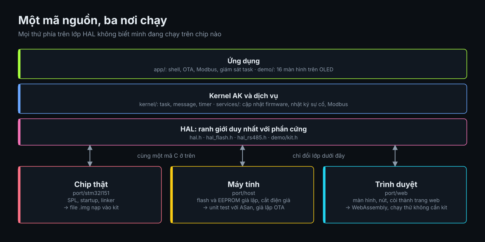
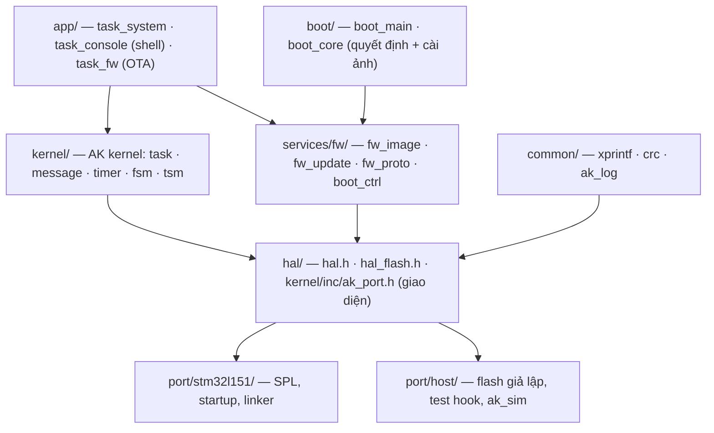
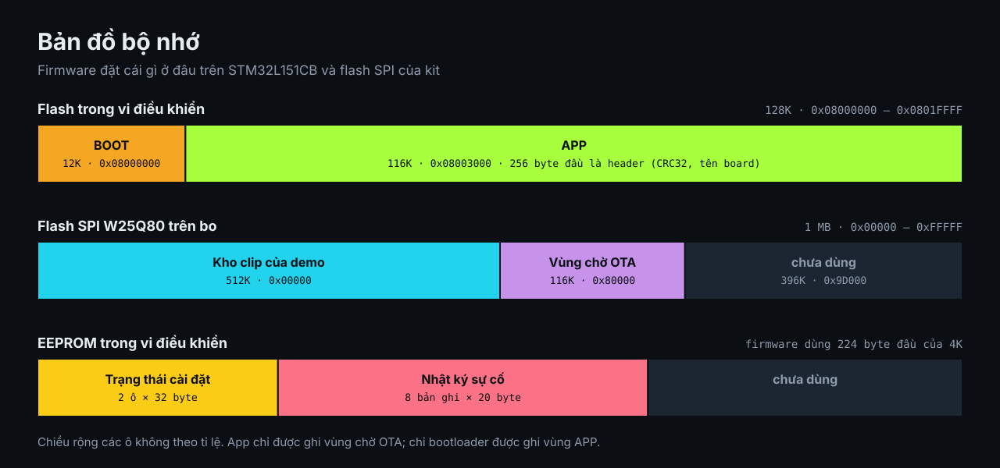
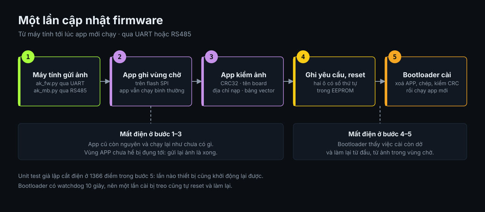

# ak-mcu-base — Source base MCU đa nền tảng (AK kernel + Bootloader/OTA)

Source base firmware **tách khỏi chip**: kernel AK Active Object, bootloader và cập nhật firmware
(OTA) viết một lần, chạy trên mọi chip có port. Port đầu tiên là **STM32L151CB** (board AK Base
Kit). Port **host** (Linux/macOS) dùng để chạy unit test và giả lập cả hệ thống ngay trên máy tính,
không cần board.


*Demo trên kit: đồng hồ số, bảy game, khối 3D, mê cung 3D, máy hát, video, trạm thời tiết, máy hiện sóng, màn hình chờ.
**[Chạy thử ngay trên trình duyệt](https://hohoanganh.github.io/ak-base-kit-pio/play/)**, không cần kit. Chi tiết: [docs/demo-kit.md](docs/demo-kit.md).*

> **Dự án mới:** `python tools/new_project.py <thư-mục> --board <tên-board>` xuất một dự án độc lập.
> Tiện ích có sẵn (nhật ký sự cố, giám sát task, đo stack, CI): [docs/tien-ich.md](docs/tien-ich.md).
> Modbus RTU trên RS485 (slave, master, OTA): [docs/modbus.md](docs/modbus.md).
> Demo trên kit (đồng hồ số, sáu game, khối 3D, mê cung 3D, máy hát, video, trạm thời tiết, màn hình chờ): [docs/demo-kit.md](docs/demo-kit.md).
>
> **Hơn gì, bằng gì, còn thiếu gì so với base cũ:** [docs/so-voi-base-cu.md](docs/so-voi-base-cu.md) ·
> hướng tối ưu tiếp theo: [docs/huong-toi-uu-tiep.md](docs/huong-toi-uu-tiep.md).
>
> Thư mục này độc lập với code cũ trong `../sources/`. Nó chỉ mượn SPL/CMSIS của STM32L1 ở
> `../sources/application/platform/stm32l/Libraries` để không chép trùng 9 MB.

## Kiến trúc





Code phía trên HAL **không include header của chip**. Thêm chip mới = viết `port/<chip>/`
(xem [docs/porting.md](docs/porting.md)).

```
ak-mcu-base/
├── kernel/         AK kernel bản portable (sửa 2 lỗi của bản gốc, xem dưới)
├── hal/            giao diện phần cứng: hệ thống, console, LED, watchdog, NVM, flash theo partition
├── common/         xprintf, CRC32/CRC16, log có mức độ
├── services/fw/    định dạng ảnh, ghi STAGING, giao thức nạp, vùng boot_ctrl
├── boot/           bootloader độc lập chip
├── app/            app mẫu: heartbeat + watchdog, shell, OTA
├── port/host/      port máy tính + ak_sim
├── port/stm32l151/ port STM32L151CB
├── tests/          unit test (kernel, fw/boot) + test đầu-cuối trên ak_sim
└── tools/          mkimage.py (tạo/kiểm ảnh), ak_fw.py (nạp qua UART / ak_sim)
```

## Bản đồ flash (STM32L151CB, 128K)



Mặc định (`AK_STAGING=external`): ảnh OTA chờ cài nằm trên **flash SPI ngoài W25Qxx** của board,
nên APP dùng được toàn bộ phần flash trong còn lại.

| Vùng | Địa chỉ | Kích thước | Nội dung |
|---|---|---|---|
| BOOT | `0x08000000` | 12K | bootloader (đang dùng 7,9K, build LTO) |
| APP | `0x08003000` | **116K** | `[header 256 B][app]`, vector table ở `0x08003100` |
| STAGING | SPI NOR `0x80000` | 116K | ảnh OTA chờ cài (sector 4K), cùng địa chỉ với base cũ |
| boot_ctrl | `0x08080000` | 2 × 32 B | data EEPROM: lệnh boot ↔ app, hai bản ghi luân phiên |
| crash log | `0x08080040` | 8 × 20 B | data EEPROM: tám sự cố gần nhất |

Board không gắn chip SPI thì build với `AK_STAGING=internal` (`make stm32-internal`): APP 58K tại
`0x08003000`, STAGING 58K tại `0x08011800` trong flash trong.

Flash SPI: W25Qxx trên SPI1 (PA5 SCK, PA6 MISO, PA7 MOSI), CS PB14, mode 0, 4 MHz, giống driver của
base cũ. Mỗi lần khởi động, port đọc JEDEC ID; không thấy chip (hoặc chip nhỏ hơn 1 MB) thì tắt
STAGING và in cảnh báo. Khi đó OTA báo lỗi `too big` thay vì ghi bừa, còn app đang chạy không bị ảnh
hưởng. Mặc định port không đụng tới chân nào ngoài console, LED và SPI NOR. Riêng AK Base Kit có
cắm module nRF24 (dùng chung SPI1) thì build với `-DAK_KIT_NRF24=ON` (PlatformIO: `kit_nrf24 = 1`)
để giữ CSN của nó (PB9) ở mức cao, không tranh bus.

Map nằm ở `port/stm32l151/port_cfg.h`. Kích thước APP được truyền cho linker
(`--defsym __app_part_size`) và kiểm bằng `ASSERT`: app vượt phân vùng thì link báo lỗi luôn.

## Bắt đầu nhanh

Cần: `cmake`, `gcc` (cho host), `arm-none-eabi-gcc` + newlib (cho STM32), Python 3.

```bash
cd ak-mcu-base
make test      # build host, chạy unit test + test OTA đầu-cuối trên ak_sim
make stm32     # build/stm32l151/{boot.bin, app.bin, app.img, *.elf, *.map} (staging SPI ngoài)
make stm32-internal   # staging trong flash trong, cho board không có chip SPI
make sim       # chạy giả lập: gõ 'help' trong shell, Ctrl-D để thoát
```

PlatformIO (giống quy trình ở thư mục cha):

```bash
cd ak-mcu-base
pio run -e boot -t upload      # bootloader
pio run -e app  -t upload      # app; .elf đã mang header hợp lệ
```

> Build PlatformIO đã chạy thật và ảnh đã nạp lên board (06/10/2026, toolchain gcc 7.2.1 của PlatformIO).
> CMake dùng cho Linux/macOS và CI.

### Nạp lần đầu và OTA

1. Nạp `boot.bin` vào `0x08000000` và `app.img` vào `0x08003000` (hoặc `pio run -t upload` cả hai env).
   Board trắng chỉ có bootloader thì bootloader tự vào **chế độ loader** (LED nháy nhanh) và chờ ảnh.
2. Từ đó cập nhật qua UART console (USART1, 115200), không cần ST-Link:

```bash
pip install pyserial
python3 tools/ak_fw.py --port /dev/ttyUSB0 info
python3 tools/ak_fw.py --port /dev/ttyUSB0 flash build/stm32l151/app.img
python3 tools/ak_fw.py --port /dev/ttyUSB0 loader     # ép vào bootloader
```

Thử trước trên máy tính: `python3 tools/ak_fw.py --sim build/host/ak_sim flash <ảnh>`
(tạo ảnh giả: `python3 tools/mkimage.py synthetic -o demo.img --version 1.2.0`).

## Bootloader & OTA hoạt động thế nào



- **App nhận ảnh** (qua `fw_proto` trên console, hoặc kênh khác gọi `fw_update_*()`) và ghi vào
  STAGING. Trang flash được xóa dần khi ghi tới, nên không chặn task lâu. Xong thì verify toàn bộ:
  CRC, board, địa chỉ nạp, vector table. Hợp lệ thì đặt `boot_ctrl.cmd = UPDATE` rồi reset.
- **Boot** đọc `boot_ctrl`, verify APP, rồi chọn một hành động. STAGING chỉ được đọc và kiểm khi
  cần (đang có lệnh cài, hoặc APP hỏng), nên lần boot bình thường không phải đọc 116K qua SPI:

| Tình huống | Hành động |
|---|---|
| `cmd = LOADER` | ở lại loader, chờ ảnh qua UART |
| `cmd = UPDATE`, STAGING hợp lệ, chưa quá 3 lần thử | **cài**: chép STAGING → APP |
| APP hợp lệ | chạy app |
| APP không có header, không có lần cài dở, boot build với `AK_BOOT_ALLOW_RAW_APP=ON` | chạy kèm cảnh báo |
| APP hỏng, STAGING còn ảnh | **cứu**: cài lại từ STAGING |
| còn lại | loader |

- **An toàn khi mất điện:** trang header của APP bị xóa đầu tiên và chép cuối cùng. Vì vậy mất điện
  ở bất kỳ bước nào thì APP luôn ở trạng thái "không hợp lệ", và lần boot sau chép lại từ STAGING
  (vẫn còn nguyên). Test cắt điện ở **từng** thao tác erase/write (hơn 3.200 điểm cắt): không lần
  nào chạy nhầm ảnh chép dở.
- **Chống nạp nhầm:** header có tên board (`ak-l151`); ảnh của board khác bị từ chối ngay ở `END`.
- **Header nằm sẵn trong `.elf`** (section `.fw_header`). Sau khi link, `mkimage.py patch` điền
  CRC vào cả `.img` lẫn `.elf`, nên nạp `.elf` bằng SWD/debugger cũng ra ảnh hợp lệ.
- Nhảy sang app bằng cách **reset rồi nhảy ngay trong `reset_handler`**, trước khi khởi tạo ngoại vi,
  nên app luôn bắt đầu từ chip sạch. Nguyên nhân reset thật được chuyển cho app qua RAM `.noinit`.
- HardFault: PC/LR/CFSR được lưu vào `.noinit` và in ra ở lần khởi động sau.
- **Ghi flash theo half-page (STM32L1):** mỗi khối 128 B (32 word) được ghi trong một lần thay vì
  32 lần. Hàm ghi chạy từ RAM, tắt ngắt trong lúc ghi (vì đang ghi thì cấm đọc flash, mà vector
  table/ISR đều nằm trong flash), dữ liệu luôn được chép vào buffer RAM trước khi ghi, ghi xong thì
  đọc lại để so. Đoạn lẻ không căn 128 B vẫn ghi từng word. Chunk OTA và buffer chép của boot đều
  là 128 B nên luôn đi đường nhanh. Mỗi lần tắt ngắt kéo dài cỡ một chu kỳ ghi flash (vài ms):
  byte UART tới đúng lúc đó có thể bị mất, nhưng giao thức nạp là hỏi-đáp nên không ảnh hưởng.

- **`boot_ctrl` có hai bản ghi:** mỗi lần lưu ghi vào bản không chứa trạng thái mới nhất (có số thứ
  tự). Mất điện giữa lúc ghi chỉ hỏng bản đang ghi, trạng thái trước đó vẫn còn; trước đây một lần
  ghi dở làm mất cả lệnh update. **App và bootloader phải cùng đời:** bootloader cũ (1.0.0) chỉ đọc
  bản ghi thứ nhất nên bỏ sót lệnh của app mới.
- **Bootloader có watchdog** (IWDG 10 s): treo bus hay flash thì reset thay vì chết đứng, và bộ đếm
  3 lần thử chặn vòng lặp cài hỏng. Các vòng chờ SPI của flash ngoài đều có giới hạn.
- **Console TX của app không chặn:** `hal_console_putc()` đưa byte vào ring 256 B, ngắt TXE gửi dần,
  nên một dòng log không giữ task suốt thời gian truyền (87 µs/ký tự ở 115200). Ring đầy thì task
  chờ ngắt rút bớt; khi ngắt đang che hoặc đang trong ISR (FATAL) thì gửi polled, không mất byte.
  Bootloader vẫn TX polled.
- **Shell:** `info` chỉ kiểm header của APP/STAGING (nhanh); `verify` mới tính CRC toàn ảnh, tức đọc
  hết ảnh (STAGING qua SPI) trong lúc không task nào chạy.

Giao thức (`services/fw/fw_proto.h`): khung `A5 | cmd | seq | len | payload | crc16`, gồm các lệnh
INFO / BEGIN / DATA / END / INSTALL / LOADER / RESET / RUN. Byte `0xA5` không phải ASCII nên giao
thức dùng chung một UART với shell text.

## Kernel AK: khác gì bản gốc

Giữ nguyên API (`task_post_*`, `timer_set`, `fsm`/`tsm`, bảng task), chỉ đổi phần phụ thuộc chip
sang `ak_port.h`. Có sửa các lỗi sau (đều có test):

1. `get_current_task_id()` trả `if_des_task_id` thay vì `des_task_id`. Hậu quả: message tạo trong
   task mang `src_task_id` sai (thường là 0).
2. `LOG2LKUP(0)` gọi `__builtin_clz(0)`, là hành vi không xác định (UB) trên x86. Trên ARM không lộ
   ra vì lệnh `CLZ` trả 32.
3. `task_create()` thêm kiểm tra `pri` hợp lệ (1..8). Trước đây `pri` = 0 làm ghi ra ngoài mảng.
4. Timer mềm lưu **mốc hết hạn tuyệt đối** thay cho bộ đếm lùi. Trước đây timer chu kỳ xử lý trễ
   thì các chu kỳ sau trôi theo, và `timer_set()` gọi sau một handler chạy lâu bị trừ luôn số tick
   đã dồn lại nên nổ sớm. Ngắt tick giờ chỉ post `TIMER_TICK` khi timer gần nhất đến hạn (trước là
   mỗi ms một message). `duty` phải nhỏ hơn 2^31 ms.
5. Ngoài task, `get_current_task_id()`/`task_self()` trả `AK_TASK_IDLE_ID`. Trước đây sau ngắt đầu
   tiên nó giữ id của task chạy gần nhất, nên message post từ polling task mang `src_task_id` sai.
6. `task_run()` kiểm hàng đợi rồi ngủ trong cùng một critical section, nên message do ngắt post
   đúng khe đó không phải chờ tới ngắt kế tiếp. `ak_port_idle()` vì vậy được gọi khi ngắt đang che.

Thêm `task_run_once()` (cho test/giả lập) và hook trace tùy chọn (`AK_TASK_TRACE_ENABLE`). Tạm bỏ
log queue debug của bản gốc.

## Đã kiểm gì / chưa kiểm gì

| Hạng mục | Trạng thái |
|---|---|
| Unit test kernel (17 ca) — ASan + UBSan | ✅ pass |
| Unit test fw/boot (14 ca; 11 ca chạy trên cả 2 kiểu staging: SPI NOR giả lập và flash trong), gồm 6.504 điểm cắt điện — ASan + UBSan | ✅ pass |
| Đầu-cuối trên ak_sim bằng chính `ak_fw.py` + `mkimage.py` (13 bước) | ✅ pass |
| Build STM32 (boot + app) cả hai chế độ staging, `-Wall -Wextra -Werror`; ASSERT kích thước APP chặn được app quá lớn | ✅ |
| Kiểm layout ảnh STM32 (header @ `0x08003000`, vector @ `0x08003100`, `.elf` == `.img`) | ✅ |
| Ghi half-page: hàm nằm trong RAM, không gọi sang flash, tắt/bật ngắt đúng (đọc lại mã máy) | ✅ |
| **Chạy trên board thật** (AK Base Kit, 06/10/2026, build LTO): boot → app qua UART, `info`/shell, OTA 10,5K qua `ak_fw.py` trong 1,6 s (SPI NOR → half-page → `boot_ctrl` EEPROM → chạy bản mới), console TX qua ngắt, IWDG 8 s không reset | ✅ |
| Bootloader 1.1.0 trên board: OTA liên tiếp qua `boot_ctrl` hai bản ghi, ở loader 16 s không reset, dừng lõi 13 s bằng debugger thì IWDG của boot reset (lý do reset 4) và quay lại loader | ✅ |
| Timeout SPI của flash ngoài; mất điện giữa lúc ghi `boot_ctrl` trên board | ❌ chưa — mới qua unit test |
| Rút điện giữa lúc boot đang cài; OTA ảnh lớn gần 116K; đo thời gian ghi half-page | ❌ chưa |
| Build bằng PlatformIO, ảnh nạp và OTA trên board | ✅ |
| Nhật ký sự cố trên board: HardFault, FATAL, task bị bỏ đói, handler treo đều ghi đúng loại và đúng task | ✅ |
| **AK Base Kit 3.0, 07/10/2026**, bootloader và demo build từ `main` sau v1.3.6: LED PB8 đúng pha (sáng khi chân ở mức thấp) và không còn chớp lúc khởi động — cần cả bootloader mới, vì bootloader cũ bật LED trong khoảng 73 ms nó kiểm ảnh; `ui open` mở đủ 16 màn hình; `ak_screen.py shot` chụp đủ 16 màn hình sau khi sửa lỗi `ui dump` ở màn hình System | ✅ |
| Tuỳ chọn giữ CSN của J6 (PA4, `kit_nrf24 = 1`) với mô-đun nRF24 cắm thật | ❌ chưa |

Khi thử trên board, nên kiểm theo thứ tự: log boot qua UART → `info` → OTA một ảnh →
rút điện giữa lúc boot đang cài (log `installing...`) → cắm lại phải cài tiếp và chạy.

## Giới hạn & bước tiếp theo

- **Tốc độ ghi flash STM32L1:** đã chuyển sang half-page. Về lý thuyết nhanh khoảng 32 lần so với
  ghi từng word (một chu kỳ ghi cho 32 word), nhưng **chưa đo trên board**. Khi thử, xem thời gian
  `ak_fw.py flash` in ra và khoảng giữa log `installing...` với `install ok`.
- Rollback (giữ ảnh cũ để quay lại nếu app mới không xác nhận chạy tốt) — hiện chỉ có cài lại từ STAGING.
- Ký số ảnh (hiện chỉ có CRC, đủ chống hỏng dữ liệu nhưng không chống giả mạo).
- Port thứ hai (STM32 dòng mới với HAL/LL, hoặc ESP32/GD32) để kiểm lớp HAL.
- Kênh OTA qua Modbus RS485: chỉ cần gọi `fw_update_*()` rồi post `FW_SIG_INSTALL` tới `task_fw`.
