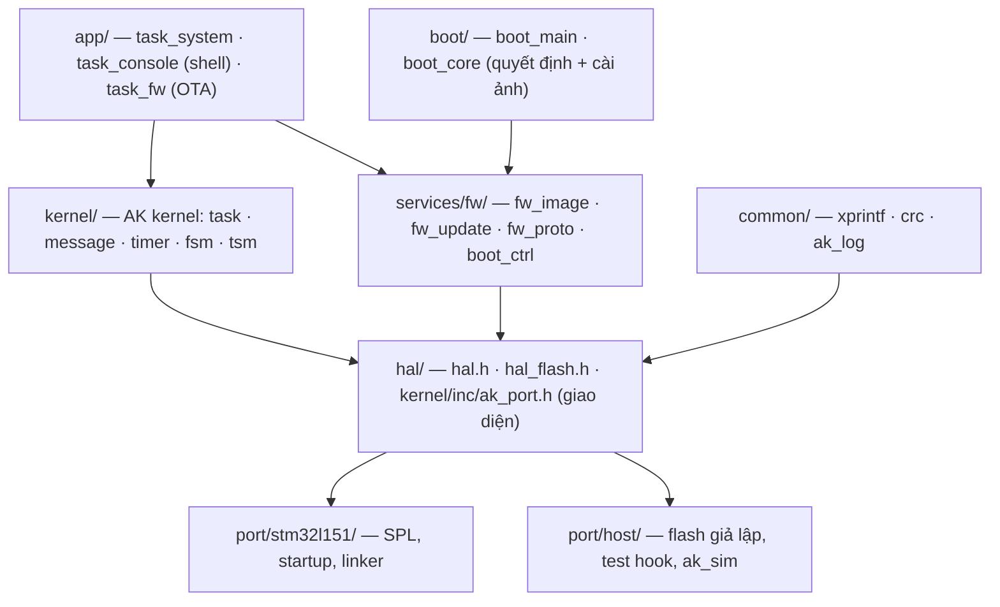

# ak-mcu-base — Source base MCU đa nền tảng (AK kernel + Bootloader/OTA)

Source base firmware **tách khỏi chip**: kernel AK Active Object, bootloader và cập nhật firmware
(OTA) viết một lần, chạy trên mọi chip có port. Port đầu tiên là **STM32L151CB** (board AK Base
Kit). Port **host** (Linux/macOS) dùng để chạy unit test và giả lập cả hệ thống ngay trên máy tính,
không cần board.

> Thư mục này độc lập với code cũ trong `../sources/`. Nó chỉ mượn SPL/CMSIS của STM32L1 ở
> `../sources/application/platform/stm32l/Libraries` để không chép trùng 9 MB.

## Kiến trúc



Code phía trên HAL **không include header của chip**. Thêm chip mới = viết `port/<chip>/`
(xem [docs/porting.md](docs/porting.md)).

```
ak-mcu-base/
├── kernel/         AK kernel bản portable (sửa 2 lỗi của bản gốc, xem dưới)
├── hal/            giao diện phần cứng: hệ thống, console, LED, watchdog, NVM, flash theo partition
├── common/         xprintf, CRC32/CRC16, log có mức độ
├── services/fw/    định dạng ảnh, ghi STAGING, giao thức nạp, vùng boot_ctrl
├── boot/           bootloader độc lập chip
├── app/            app mẫu: heartbeat + watchdog, shell, OTA
├── port/host/      port máy tính + ak_sim
├── port/stm32l151/ port STM32L151CB
├── tests/          unit test (kernel, fw/boot) + test đầu-cuối trên ak_sim
└── tools/          mkimage.py (tạo/kiểm ảnh), ak_fw.py (nạp qua UART / ak_sim)
```

## Bản đồ flash (STM32L151CB, 128K)

| Vùng | Địa chỉ | Kích thước | Nội dung |
|---|---|---|---|
| BOOT | `0x08000000` | 12K | bootloader (đang dùng 8,5K) |
| APP | `0x08003000` | 58K | `[header 256 B][app]`, vector table ở `0x08003100` |
| STAGING | `0x08011800` | 58K | ảnh OTA chờ cài |
| boot_ctrl | `0x08080000` | 20 B | data EEPROM: lệnh boot ↔ app |

Map nằm ở `port/stm32l151/port_cfg.h`; nếu sửa thì sửa luôn `boot.ld` / `app.ld`. STAGING có thể
chuyển sang flash SPI ngoài: chỉ cần port trả `hal_flash_info()` và erase/write cho vùng đó, phần còn
lại giữ nguyên. Khi đó APP được dùng gần trọn 116K.

## Bắt đầu nhanh

Cần: `cmake`, `gcc` (cho host), `arm-none-eabi-gcc` + newlib (cho STM32), Python 3.

```bash
cd ak-mcu-base
make test      # build host, chạy unit test + test OTA đầu-cuối trên ak_sim
make stm32     # build/stm32l151/{boot.bin, app.bin, app.img, *.elf, *.map}
make sim       # chạy giả lập: gõ 'help' trong shell, Ctrl-D để thoát
```

PlatformIO (giống quy trình ở thư mục cha):

```bash
cd ak-mcu-base
pio run -e boot -t upload      # bootloader
pio run -e app  -t upload      # app; .elf đã mang header hợp lệ
```

> `platformio.ini` mới được kiểm cú pháp (`pio project config`), **chưa build thật** vì môi trường
> cloud chặn registry PlatformIO. Build tham chiếu là CMake (đã build và test).

### Nạp lần đầu và OTA

1. Nạp `boot.bin` vào `0x08000000` và `app.img` vào `0x08003000` (hoặc `pio run -t upload` cả hai env).
   Board trắng chỉ có bootloader thì bootloader tự vào **chế độ loader** (LED nháy nhanh) và chờ ảnh.
2. Từ đó cập nhật qua UART console (USART1, 115200), không cần ST-Link:

```bash
pip install pyserial
python3 tools/ak_fw.py --port /dev/ttyUSB0 info
python3 tools/ak_fw.py --port /dev/ttyUSB0 flash build/stm32l151/app.img
python3 tools/ak_fw.py --port /dev/ttyUSB0 loader     # ép vào bootloader
```

Thử trước trên máy tính: `python3 tools/ak_fw.py --sim build/host/ak_sim flash <ảnh>`
(tạo ảnh giả: `python3 tools/mkimage.py synthetic -o demo.img --version 1.2.0`).

## Bootloader & OTA hoạt động thế nào

- **App nhận ảnh** (qua `fw_proto` trên console, hoặc kênh khác gọi `fw_update_*()`) và ghi vào
  STAGING. Trang flash được xóa dần khi ghi tới, nên không chặn task lâu. Xong thì verify toàn bộ:
  CRC, board, địa chỉ nạp, vector table. Hợp lệ thì đặt `boot_ctrl.cmd = UPDATE` rồi reset.
- **Boot** đọc `boot_ctrl`, verify APP và STAGING, rồi chọn một hành động:

| Tình huống | Hành động |
|---|---|
| `cmd = LOADER` | ở lại loader, chờ ảnh qua UART |
| `cmd = UPDATE`, STAGING hợp lệ, chưa quá 3 lần thử | **cài**: chép STAGING → APP |
| APP hợp lệ | chạy app |
| APP không có header (nạp `.elf` debug), không có lần cài dở | chạy kèm cảnh báo |
| APP hỏng, STAGING còn ảnh | **cứu**: cài lại từ STAGING |
| còn lại | loader |

- **An toàn khi mất điện:** trang header của APP bị xóa đầu tiên và chép cuối cùng. Vì vậy mất điện
  ở bất kỳ bước nào thì APP luôn ở trạng thái "không hợp lệ", và lần boot sau chép lại từ STAGING
  (vẫn còn nguyên). Test cắt điện ở **từng** thao tác erase/write (hơn 3.200 điểm cắt): không lần
  nào chạy nhầm ảnh chép dở.
- **Chống nạp nhầm:** header có tên board (`ak-l151`); ảnh của board khác bị từ chối ngay ở `END`.
- **Header nằm sẵn trong `.elf`** (section `.fw_header`). Sau khi link, `mkimage.py patch` điền
  CRC vào cả `.img` lẫn `.elf`, nên nạp `.elf` bằng SWD/debugger cũng ra ảnh hợp lệ.
- Nhảy sang app bằng cách **reset rồi nhảy ngay trong `reset_handler`**, trước khi khởi tạo ngoại vi,
  nên app luôn bắt đầu từ chip sạch. Nguyên nhân reset thật được chuyển cho app qua RAM `.noinit`.
- HardFault: PC/LR/CFSR được lưu vào `.noinit` và in ra ở lần khởi động sau.
- **Ghi flash theo half-page (STM32L1):** mỗi khối 128 B (32 word) được ghi trong một lần thay vì
  32 lần. Hàm ghi chạy từ RAM, tắt ngắt trong lúc ghi (vì đang ghi thì cấm đọc flash, mà vector
  table/ISR đều nằm trong flash), dữ liệu luôn được chép vào buffer RAM trước khi ghi, ghi xong thì
  đọc lại để so. Đoạn lẻ không căn 128 B vẫn ghi từng word. Chunk OTA và buffer chép của boot đều
  là 128 B nên luôn đi đường nhanh. Mỗi lần tắt ngắt kéo dài cỡ một chu kỳ ghi flash (vài ms):
  byte UART tới đúng lúc đó có thể bị mất, nhưng giao thức nạp là hỏi-đáp nên không ảnh hưởng.

Giao thức (`services/fw/fw_proto.h`): khung `A5 | cmd | seq | len | payload | crc16`, gồm các lệnh
INFO / BEGIN / DATA / END / INSTALL / LOADER / RESET / RUN. Byte `0xA5` không phải ASCII nên giao
thức dùng chung một UART với shell text.

## Kernel AK: khác gì bản gốc

Giữ nguyên API (`task_post_*`, `timer_set`, `fsm`/`tsm`, bảng task), chỉ đổi phần phụ thuộc chip
sang `ak_port.h`. Có sửa các lỗi sau (đều có test):

1. `get_current_task_id()` trả `if_des_task_id` thay vì `des_task_id`. Hậu quả: message tạo trong
   task mang `src_task_id` sai (thường là 0).
2. `LOG2LKUP(0)` gọi `__builtin_clz(0)`, là hành vi không xác định (UB) trên x86. Trên ARM không lộ
   ra vì lệnh `CLZ` trả 32.
3. `task_create()` thêm kiểm tra `pri` hợp lệ (1..8). Trước đây `pri` = 0 làm ghi ra ngoài mảng.

Thêm `task_run_once()` (cho test/giả lập) và hook trace tùy chọn (`AK_TASK_TRACE_ENABLE`). Tạm bỏ
log queue debug của bản gốc.

## Đã kiểm gì / chưa kiểm gì

| Hạng mục | Trạng thái |
|---|---|
| Unit test kernel (12 ca) — ASan + UBSan | ✅ pass |
| Unit test fw/boot (13 ca), gồm 3.252 điểm cắt điện — ASan + UBSan | ✅ pass |
| Đầu-cuối trên ak_sim bằng chính `ak_fw.py` + `mkimage.py` (13 bước) | ✅ pass |
| Build STM32 (boot + app), `-Wall -Wextra -Werror` | ✅ |
| Kiểm layout ảnh STM32 (header @ `0x08003000`, vector @ `0x08003100`, `.elf` == `.img`) | ✅ |
| Ghi half-page: hàm nằm trong RAM, không gọi sang flash, tắt/bật ngắt đúng (đọc lại mã máy) | ✅ |
| **Chạy trên board thật** (UART, flash/EEPROM, half-page, IWDG, nhảy app) | ❌ chưa — cloud không có phần cứng |
| Build bằng PlatformIO | ❌ chưa — registry bị chặn trên cloud |

Khi thử trên board, nên kiểm theo thứ tự: log boot qua UART → `info` → OTA một ảnh →
rút điện giữa lúc boot đang cài (log `installing...`) → cắm lại phải cài tiếp và chạy.

## Giới hạn & bước tiếp theo

- **Tốc độ ghi flash STM32L1:** đã chuyển sang half-page. Về lý thuyết nhanh khoảng 32 lần so với
  ghi từng word (một chu kỳ ghi cho 32 word), nhưng **chưa đo trên board**. Khi thử, xem thời gian
  `ak_fw.py flash` in ra và khoảng giữa log `installing...` với `install ok`.
- STAGING trên flash SPI ngoài (board có sẵn chip flash) để app dùng gần trọn 116K.
- Rollback (giữ ảnh cũ để quay lại nếu app mới không xác nhận chạy tốt) — hiện chỉ có cài lại từ STAGING.
- Ký số ảnh (hiện chỉ có CRC, đủ chống hỏng dữ liệu nhưng không chống giả mạo).
- Port thứ hai (STM32 dòng mới với HAL/LL, hoặc ESP32/GD32) để kiểm lớp HAL.
- Kênh OTA qua Modbus RS485: chỉ cần gọi `fw_update_*()` rồi post `FW_SIG_INSTALL` tới `task_fw`.
