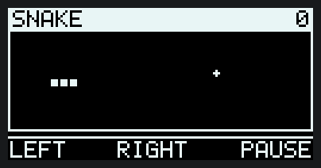
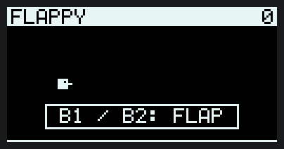
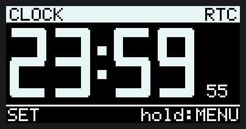
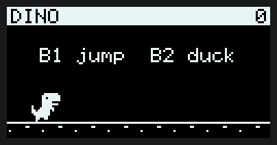
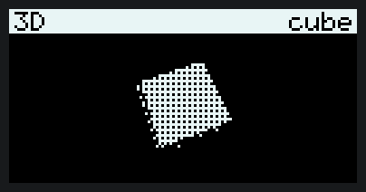
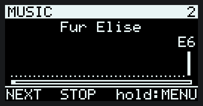

# Demo trên AK Base Kit: đồng hồ số, ba game, khối 3D, máy hát

Bộ demo chạy trên nền `ak-mcu-base`, dùng màn hình OLED 128×64, ba nút bấm và còi của kit.
Nó vẫn giữ nguyên mọi thứ của app mẫu: shell, OTA qua UART, Modbus slave, nhật ký sự cố.


| Snake | Flappy | Đồng hồ qua nửa đêm |
|---|---|---|
|  |  |  |
| **Dino runner** | **Khối 3D** | **Máy hát** |
|  |  |  |

Các ảnh động trên **không phải ảnh chụp**: `tests/test_demo.c` chạy đúng mã vẽ và mã game của firmware trên máy tính,
ghi lại từng khung, rồi `tools/demo_gif.py` dựng thành GIF. Trong ảnh, ba game đang ở chế độ tự chơi. Máy hát phát ra còi của kit nên ảnh động không có tiếng.
Ảnh tĩnh của mọi màn hình: [demo-screens.png](demo-screens.png).

Dựng lại ảnh sau khi sửa mã:

```bash
cmake -S . -B build/host && cmake --build build/host --target test_demo
mkdir -p build/rec && build/host/test_demo build/rec record
python tools/demo_gif.py build/rec docs
```

## Build và nạp

```bash
pio run -e demo -t upload
```

Hoặc cập nhật qua UART khi kit đang chạy `ak-mcu-base`:

```bash
python tools/ak_fw.py --port COMx flash .pio/build/demo/app.img
```

## Cách bấm

Ba nút dưới màn hình, từ trái sang phải: B1, B2, B3. Dòng cuối màn hình ghi chức năng ngay trên từng nút.

| Màn hình | B1 | B2 | B3 bấm | B3 giữ |
|---|---|---|---|---|
| Menu | Xuống | Lên | Mở | — |
| Đồng hồ | Chọn giờ / phút để chỉnh | +1 | — | Về menu |
| Snake | Rẽ trái | Rẽ phải | Tạm dừng | Về menu |
| Flappy | Vỗ cánh | Vỗ cánh | — | Về menu |
| Dino | Nhảy | Cúi (giữ nút) | — | Về menu |
| Khối 3D | Đổi khối | Tốc độ quay | Khung dây / tô bóng | Về menu |
| Máy hát | Bài kế | Phát / dừng | — | Về menu |
| Hệ thống | Bíp | — | — | Về menu |

- **Đồng hồ** lấy giờ từ RTC PCF85063 của kit; không thấy RTC thì tự đếm từ tick 1 ms (góc phải ghi `RTC` hoặc `soft`).
- **Snake** nhanh dần theo điểm. Rẽ trái/phải tính theo hướng con rắn đang đi.
- **Dino** nhanh dần theo điểm; chim chỉ xuất hiện sau 120 điểm và phải cúi mới qua được.
- **Khối 3D** có lập phương, bát diện và kim tự tháp. Chip không có FPU nên mọi phép tính là số nguyên (bảng sin 256 mục);
  màn hình 1 bit nên độ sáng từng mặt được giả bằng dither 4×4.
- **Máy hát** có 6 bài, đều là nhạc dân gian hoặc đã hết bản quyền từ lâu, viết bằng chuỗi RTTTL trong `demo/scr_music.c`.
  Rời màn hình là nhạc dừng.
- **Hệ thống** hiện uptime, mức dùng pool message, RAM chưa từng dùng, số bản ghi sự cố, thời gian vẽ khung trước.

## Điều khiển qua shell

Không cần đứng cạnh kit vẫn thử được:

```
> ui
display ok, screen: Snake, last frame 20 ms, 3 of 8 pages sent, buttons 0x00
> ui 1        (bấm B1; ui 2, ui 3 tương tự)
> ui back     (giữ B3: về menu)
> ui auto     (bật/tắt tự chơi: mở một game thì game tự chạy, mở máy hát thì phát lần lượt; bấm nút để giành lại quyền điều khiển)
```

## Demo này cho thấy gì ở base

| Việc | Cách làm trên kernel AK |
|---|---|
| Vẽ 20 khung/giây | Timer chu kỳ 50 ms post `UI_SIG_FRAME` cho `task_ui`; không có vòng lặp chờ |
| Nút bấm | Polling task chống dội rồi post `UI_SIG_KEY_x`; game nhận phím như nhận message |
| Tiếng bíp | Bật còi, đặt timer một lần post `UI_SIG_BEEP_OFF`; không `delay` |
| Phát nhạc | `music_step()` bật nốt kế và trả về độ dài; timer một lần post `UI_SIG_NOTE` đúng lúc nốt hết. Không có vòng lặp chờ nên game và shell vẫn chạy |
| Màn hình I2C chậm | Chỉ gửi những trang đã đổi (8 trang × 128 byte): đồng hồ thường gửi 0–2 trang mỗi khung |
| Vẫn phản hồi | Shell, Modbus và OTA chạy song song; `task_ui` ưu tiên thấp hơn chúng |

Số đo trên kit: dựng một khung mất 4–6 ms, mỗi trang gửi ra màn hình mất khoảng 5 ms (I2C bit-bang).
Khối 3D đổi 5 trên 8 trang mỗi khung nên tốn 34–37 ms, vẫn kịp nhịp 50 ms; Dino tối đa 24 ms.

Ý tưởng cho các demo tiếp theo (Game of Life, Bad Apple, trạm thời tiết, raycaster…), kèm nguồn tham khảo:
[y-tuong-demo.md](y-tuong-demo.md).

## Thêm một màn hình

1. Tạo `demo/scr_ten.c`, khai một `ui_screen_t` với các hàm `enter`, `key`, `frame` và `leave` (để 0 nếu không cần dọn gì khi rời màn hình).
2. Thêm `extern const ui_screen_t scr_ten;` vào `demo/ui.h` và một dòng vào `menu_items[]` trong `demo/ui_common.c`.
3. Trong `frame()`: cập nhật trạng thái, `gfx_clear()`, vẽ lại. Không gọi gì chờ đợi; cần thời gian thì đếm khung.

Mã màn hình không đụng tới chip (`demo/kit.h` là ranh giới), nên thêm một ca trong `tests/test_demo.c` là xem được
ảnh trên máy tính trước khi nạp.

## Phần cứng (AK Base Kit 3I0)

| Thứ | Chân | Ghi chú |
|---|---|---|
| OLED SSD1309 128×64 | SCL PB13, SDA PB12, RES PA15 | I2C `0x3C`, bit-bang |
| Nút B1, B2, B3 | PB3, PC13, PB4 | Nối GND, kéo lên trong chip |
| Còi | PB0 (TIM3_CH3) | PWM |
| RTC PCF85063 | SCL PB6, SDA PB7 | I2C `0x51`, bit-bang |

PA15, PB3, PB4 là chân JTAG; demo dùng chúng làm GPIO nên JTAG mất, SWD vẫn dùng được.
Driver nằm ở `port/stm32l151/kit.c`. Board khác chỉ cần viết lại file này theo `demo/kit.h`.
