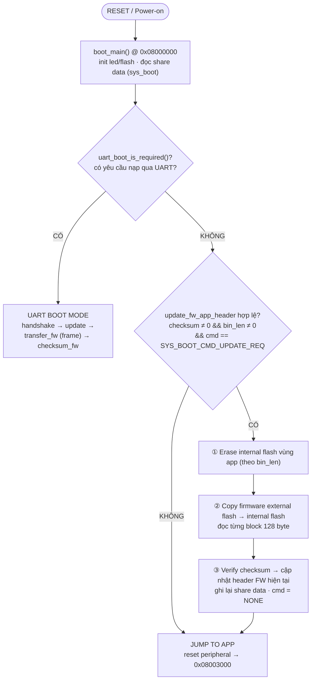
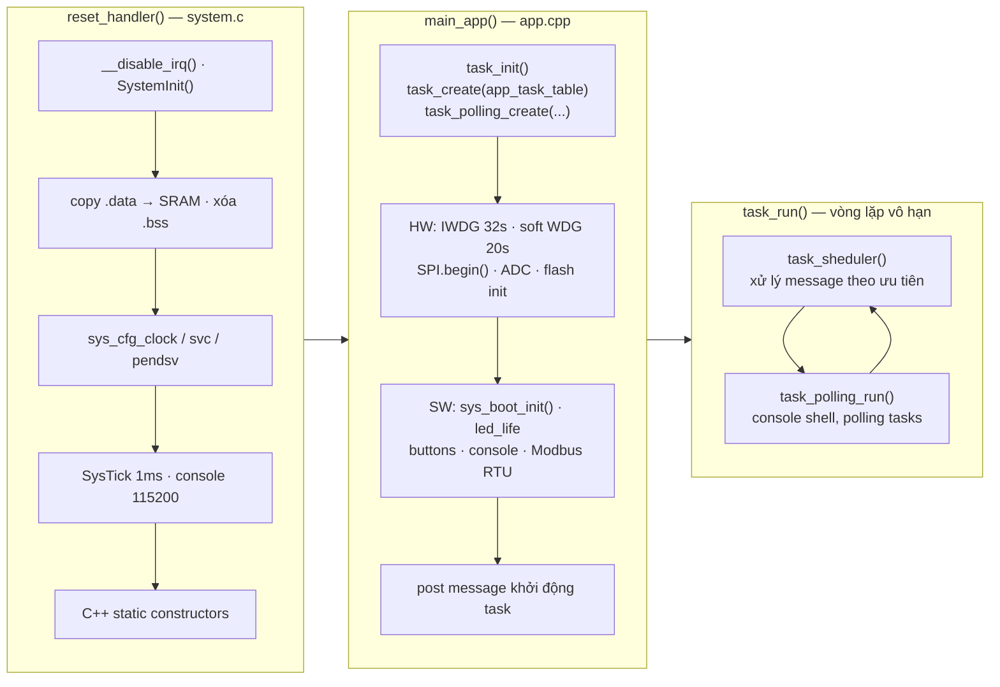
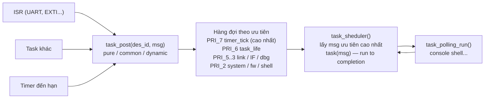
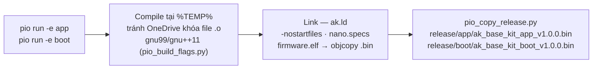

# AK Base Kit PIO — Tài Liệu Luồng Hoạt Động Firmware

**EPCB® IOT SERVICES** · STM32L151CBT6 · PlatformIO · Bootloader + Application · AK Kernel

Tài liệu mô tả kiến trúc và các luồng hoạt động chính của source base `ak-base-kit-pio` — nền tảng phát triển firmware EPCB, port từ AK Embedded Base Kit sang PlatformIO. Firmware gồm 2 phần độc lập: **bootloader** (8K, tự viết, hỗ trợ cập nhật firmware qua UART/external flash) và **application** (116K, chạy trên kernel AK — mô hình Active Object / message-driven, không dùng RTOS).

> Bản HTML có sơ đồ đồ họa: <https://akbasekitpio.netlify.app/> (file gốc: `docs/ak-base-kit-pio-luong-hoat-dong.html`)

**Mục lục:** [1. Bản đồ bộ nhớ](#1-bản-đồ-bộ-nhớ-flash--ram) · [2. Kiến trúc phân lớp](#2-kiến-trúc-phân-lớp-application) · [3. Luồng bootloader](#3-luồng-nguồn-lên--bootloader-boot_main) · [4. Khởi động application](#4-luồng-khởi-động-application) · [5. Kernel AK](#5-kernel-ak--bộ-lập-lịch-message-driven) · [6. Luồng timer](#6-luồng-timer-systick--task) · [7. Bảng task](#7-bảng-task--mức-ưu-tiên-task_listcpp) · [8. Build & release](#8-luồng-build--release-platformio) · [9. Cấu trúc thư mục](#9-cấu-trúc-thư-mục)

---

## 1. Bản Đồ Bộ Nhớ Flash / RAM

### Flash 128K

| Vùng | Địa chỉ | Kích thước | Ghi chú |
|------|---------|-----------|---------|
| **Bootloader** | `0x08000000` | 8K | `pio run -e boot` — ENTRY(reset_handler), `boot/platform/stm32l/ak.ld` |
| **BSF** (Boot Share Data) | `0x08002000` | 4K | Header FW hiện tại / FW update, lệnh update (`sys_boot`) |
| **Application** | `0x08003000` | 116K | `pio run -e app` — `-DAPP_START_ADDR=0x08003000`, `application/platform/stm32l/ak.ld` |

### SRAM 16K

| Vùng | Ghi chú |
|------|---------|
| `.data` + `.bss` | Biến toàn cục |
| heap | `malloc` / message động |
| `.non_clear_ram` | **Giữ dữ liệu qua soft-reboot** (`app_non_clear_ram.cpp`) |
| stack ↓ | Từ đỉnh RAM xuống |

## 2. Kiến Trúc Phân Lớp (Application)

```
┌─────────────────────────────────────────────────────────────────────────┐
│ APPLICATION TASKS — sources/application/app/                            │
│ task_system · task_fw · task_shell · task_life · task_if ·              │
│ task_uart_if · task_dbg · task_display · screens (idle/startup/qrcode)  │
├────────────────────────────────────┬────────────────────────────────────┤
│ AK KERNEL — ak/                    │ NETWORKS / LIBRARIES               │
│ task scheduler · message pool ·    │ mbmaster (Modbus RTU) · net/link   │
│ timer · fsm / tsm                  │ (UART frame) · ArduinoJson · QRCode│
├────────────────────────────────────┼────────────────────────────────────┤
│ DRIVERS — driver/                  │ COMMON — common/                   │
│ button · buzzer · eeprom · flash   │ xprintf · cmd_line (shell) ·       │
│ (SPI) · gpio · led · OLED SSD1309  │ fifo / ring_buffer · view_render   │
├────────────────────────────────────┴────────────────────────────────────┤
│ PLATFORM — platform/stm32l/                                             │
│ reset_handler + vector table (system.c) · io_cfg / sys_cfg ·            │
│ Arduino core (SPI · Wire · HardwareSerial) · SPL StdPeriph + CMSIS      │
├──────────────────────────────────────────────────────────────────────────┤
│ HARDWARE — STM32L151CBT6 (Cortex-M3 · 32MHz · 128K/16K)                  │
│ + External SPI Flash + EEPROM                                            │
└──────────────────────────────────────────────────────────────────────────┘
```

## 3. Luồng Nguồn Lên — Bootloader (`boot_main()`)

Sau reset, CPU luôn chạy bootloader tại `0x08000000`. Bootloader đọc vùng share data (header firmware hiện tại / firmware chờ update), kiểm tra yêu cầu cập nhật rồi quyết định nhảy sang application, cập nhật firmware, hoặc vào chế độ nhận firmware qua UART.



## 4. Luồng Khởi Động Application

Vector table của app đặt tại `0x08003000` (khai báo trong `platform/stm32l/system.c`, linker script `ak.ld`). `reset_handler()` tự dựng môi trường C/C++ rồi gọi `main_app()`.



File tham chiếu:

| File | Vai trò |
|------|---------|
| `platform/stm32l/system.c` | `reset_handler()`, vector table, `systick_handler()` |
| `app/app.cpp` | `main_app()`, init phần cứng + phần mềm |
| `ak/src/task.c` | `task_init()`, `task_create()`, `task_run()`, `task_sheduler()` |

## 5. Kernel AK — Bộ Lập Lịch Message-Driven

Kernel AK theo mô hình **Active Object**: mỗi task là một hàm nhận message, không có context switch. Message được post vào hàng đợi theo mức ưu tiên của task đích (8 mức, bitmask `task_ready` + tra cứu `LOG2LKUP`). Scheduler luôn lấy message của task có ưu tiên **cao nhất** đang chờ; task chạy đến khi xử lý xong message (run-to-completion).



Message pool (cấu hình trong `platformio.ini`):

| Loại | Pool | Đặc điểm |
|------|------|----------|
| Pure | `AK_PURE_MSG_POOL_SIZE = 32` | Chỉ signal, không data |
| Common | `AK_COMMON_MSG_POOL_SIZE = 8` | Data ≤ 64 byte (`AK_COMMON_MSG_DATA_SIZE`) |
| Dynamic | `AK_DYNAMIC_MSG_POOL_SIZE = 8` | `malloc`, độ dài tùy ý |
| Timer | `AK_TIMER_POOL_SIZE = 16` | ONE_SHOT / PERIODIC |

## 6. Luồng Timer (SysTick → Task)

```
SysTick 1ms          timer_tick()         task_post(              task_timer_tick()     post sig → task
systick_handler()  → đếm lùi các timer  → TIMER_TICK_ID)        → duyệt timer đến hạn → ONE_SHOT / PERIODIC
                                           PRI_7 — cao nhất
```

## 7. Bảng Task & Mức Ưu Tiên (`task_list.cpp`)

| Task ID | Handler | Ưu tiên | Vai trò |
|---------|---------|---------|---------|
| `TASK_TIMER_TICK_ID` | `task_timer_tick` | **PRI_7** | Dispatch timer kernel — luôn chạy trước mọi task |
| `AC_TASK_LIFE_ID` | `task_life` | **PRI_6** | LED nhịp sống, nuôi watchdog (IWDG + soft WDG) |
| `AC_LINK_ID` | `task_link` | PRI_5 | Tầng link UART — quản lý phiên/dữ liệu |
| `AC_TASK_IF_ID` / `UART_IF` / `RF24_IF` | `task_if` / `task_uart_if` / `task_rf24_if` | PRI_4 | Interface gateway giữa các giao diện |
| `AC_LINK_MAC_ID` | `task_link_mac` | PRI_4 | Tầng MAC của link UART |
| `AC_TASK_DBG_ID` / `DISPLAY_ID` | `task_dbg` / `task_display` | PRI_4 | Debug log · màn hình OLED (screen manager) |
| `AC_LINK_PHY_ID` | `task_link_phy` | PRI_3 | Tầng vật lý link UART (frame parser) |
| `AC_TASK_SYSTEM_ID` / `FW_ID` / `SHELL_ID` | `task_system` / `task_fw` / `task_shell` | PRI_2 | Quản lý hệ thống · cập nhật FW · shell lệnh |
| `AC_TASK_POLLING_CONSOLE_ID` | `task_polling_console` | POLLING | Đọc ký tự console → `cmd_line` (mỗi vòng lặp) |

> **Lưu ý:** `task_zigbee` (PRI_4) và nhóm task nRF24 có sẵn trong source nhưng đang **tắt** bằng cờ biên dịch (`TASK_ZIGBEE_EN`, `IF_NETWORK_NRF24_EN`) trong `platformio.ini` — giống cấu hình Makefile gốc. Số ưu tiên càng lớn chạy càng trước.

## 8. Luồng Build & Release (PlatformIO)



- Nạp: `pio run -e app -t upload` (ST-Link) · Console: `pio device monitor` (UART1 115200)
- Đổi version: sửa `-DAPP_VERSION` trong `platformio.ini` — tên file release tự đổi theo

## 9. Cấu Trúc Thư Mục

```
ak-base-kit-pio/
├── platformio.ini            # cấu hình build: [env:app] + [env:boot], module bật/tắt
├── boards/genericSTM32L151CB_bare.json
├── pio_build_flags.py        # cờ C/C++ riêng + cờ link (-nostartfiles, nano.specs...)
├── pio_copy_release.py       # tự copy .bin/.elf về release/<env>/ kèm version
├── release/                  # firmware thành phẩm
└── sources/
    ├── application/          # firmware ứng dụng — 0x08003000
    │   ├── ak/               # kernel AK: task, message, timer, fsm/tsm
    │   ├── app/              # task ứng dụng, task_list, screens OLED
    │   ├── common/           # xprintf, cmd_line, fifo/ring_buffer
    │   ├── driver/           # button, buzzer, eeprom, flash, led, OLED
    │   ├── libraries/        # ArduinoJson, nlohmann, QRCode
    │   ├── networks/         # mbmaster (Modbus RTU), net/link UART
    │   ├── platform/stm32l/  # startup, io_cfg/sys_cfg, Arduino core, SPL+CMSIS, ak.ld
    │   └── sys/              # sys_boot (share data update FW), sys_dbg
    └── boot/                 # bootloader — 0x08000000, 8K
        ├── app/              # boot_main, uart_boot (giao thức nạp UART)
        ├── driver/           # led, flash, eeprom (rút gọn)
        ├── platform/stm32l/  # startup boot, SPL+CMSIS, ak.ld (8K)
        └── sys/              # sys_boot — đọc/ghi header FW
```

---

**Tài liệu liên quan:** quy ước build, bẫy OneDrive và cách bật lại module (zigbee, nRF24, SH1106) xem `README.md`. Source gốc: `_reference/ak-base-kit-stm32l151-main` (Makefile) · `_reference/Smart-PDU-firmware` (mô hình PlatformIO).

*EPCB Vietnam · contact@epcb.vn · (+84) 367 939 867 · www.epcb.vn*
