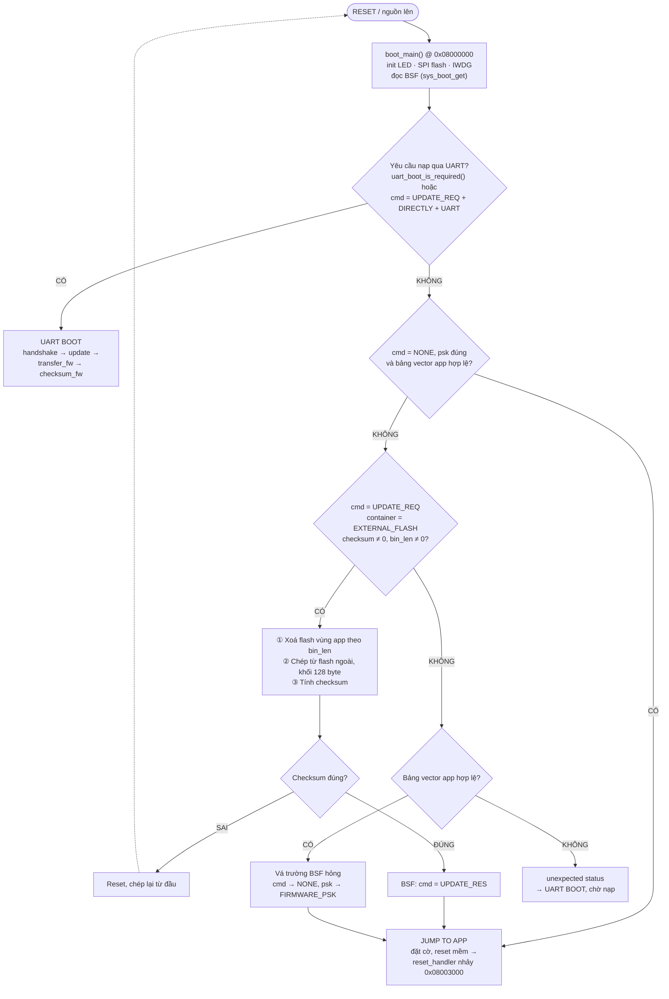
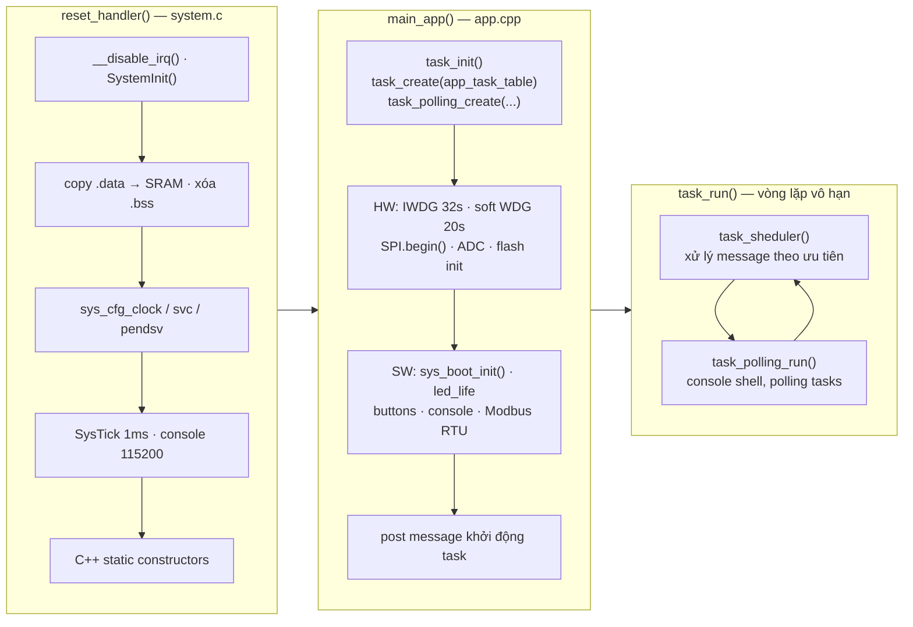
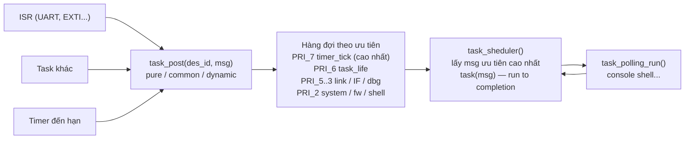
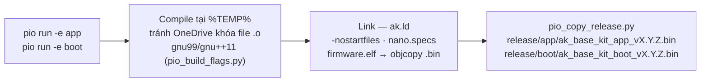

# AK Base Kit PIO — Tài liệu luồng hoạt động firmware

STM32L151CBT6 · PlatformIO · Bootloader + Application · AK Kernel

Tài liệu mô tả kiến trúc và các luồng hoạt động chính của source base `ak-base-kit-pio`, port từ
[AK Embedded Base Kit](https://github.com/the-ak-foundation/ak-base-kit-stm32l151) sang PlatformIO.
Firmware gồm 2 phần độc lập: **bootloader** (8K, hỗ trợ cập nhật firmware qua UART/external flash) và
**application** (116K, chạy trên kernel AK — mô hình Active Object / message-driven, không dùng RTOS).

**Mục lục:** [1. Bản đồ bộ nhớ](#1-bản-đồ-bộ-nhớ-flash--ram) · [2. Kiến trúc phân lớp](#2-kiến-trúc-phân-lớp-application) · [3. Luồng bootloader](#3-luồng-nguồn-lên--bootloader-boot_main) · [4. Khởi động application](#4-luồng-khởi-động-application) · [5. Kernel AK](#5-kernel-ak--bộ-lập-lịch-message-driven) · [6. Luồng timer](#6-luồng-timer-systick--task) · [7. Bảng task](#7-bảng-task--mức-ưu-tiên-task_listcpp) · [8. Build & release](#8-luồng-build--release-platformio) · [9. Cấu trúc thư mục](#9-cấu-trúc-thư-mục)

---

## 1. Bản đồ bộ nhớ Flash / RAM

### Flash 128K

| Vùng | Địa chỉ | Kích thước | Ghi chú |
|------|---------|-----------|---------|
| **Bootloader** | `0x08000000` | 8K | `pio run -e boot` — ENTRY(reset_handler), `boot/platform/stm32l/ak.ld` |
| **BSF** (Boot Share Data) | `0x08002000` | 4K | Header FW hiện tại / FW update, lệnh update (`sys_boot`) |
| **Application** | `0x08003000` | 116K | `pio run -e app` — `-DAPP_START_ADDR=0x08003000`, `application/platform/stm32l/ak.ld` |

### SRAM 16K

| Vùng | Ghi chú |
|------|---------|
| `.data` + `.bss` | Biến toàn cục |
| heap | `malloc` / message động |
| `.non_clear_ram` | **Giữ dữ liệu qua soft-reboot** (`app_non_clear_ram.cpp`) |
| stack ↓ | Từ đỉnh RAM xuống |

## 2. Kiến trúc phân lớp (Application)

```
┌─────────────────────────────────────────────────────────────────────────┐
│ APPLICATION TASKS — sources/application/app/                            │
│ task_system · task_fw · task_shell · task_life · task_if ·              │
│ task_uart_if · task_dbg · task_display · screens (idle/startup/qrcode)  │
├────────────────────────────────────┬────────────────────────────────────┤
│ AK KERNEL — ak/                    │ NETWORKS / LIBRARIES               │
│ task scheduler · message pool ·    │ mbmaster (Modbus RTU) · net/link   │
│ timer · fsm / tsm                  │ (UART frame) · ArduinoJson · QRCode│
├────────────────────────────────────┼────────────────────────────────────┤
│ DRIVERS — driver/                  │ COMMON — common/                   │
│ button · buzzer · eeprom · flash   │ xprintf · cmd_line (shell) ·       │
│ (SPI) · gpio · led · OLED SSD1309  │ fifo / ring_buffer · view_render   │
├────────────────────────────────────┴────────────────────────────────────┤
│ PLATFORM — platform/stm32l/                                             │
│ reset_handler + vector table (system.c) · io_cfg / sys_cfg ·            │
│ Arduino core (SPI · Wire · HardwareSerial) · SPL StdPeriph + CMSIS      │
├─────────────────────────────────────────────────────────────────────────┤
│ HARDWARE — STM32L151CBT6 (Cortex-M3 · 32MHz · 128K/16K)                 │
│ + External SPI Flash + EEPROM                                           │
└─────────────────────────────────────────────────────────────────────────┘
```

## 3. Luồng nguồn lên — Bootloader (`boot_main()`)

Sau reset, CPU luôn chạy bootloader tại `0x08000000`. Bootloader đọc vùng share data (BSF), kiểm tra
yêu cầu cập nhật rồi quyết định nhảy sang application, cập nhật firmware, hoặc vào chế độ nhận
firmware qua UART. Sơ đồ khớp bootloader **0.0.3** (`sources/boot/app/app.cpp`).



- **"Bảng vector app hợp lệ"** (`app_image_is_plausible()`, từ bootloader 0.0.2): con trỏ stack ban
  đầu nằm trong SRAM, vector reset là địa chỉ Thumb nằm trong vùng app. Flash app trống đọc ra 0 nên
  trượt — bootloader chờ nạp UART thay vì nhảy vào rác.
- Sau cập nhật, bootloader để `cmd = UPDATE_RES`; **app** xoá về `NONE` ở `FW_CHECKING_REQ` sau 5 s
  (`task_fw`), kèm gửi thông báo "cập nhật xong" cho host.
- Bootloader < 0.0.2 không có nhánh vá BSF: BSF bị xoá giữa chừng hay reset trong 5 s sau OTA là kẹt
  ở UART boot. Xem [known-bugs.md](known-bugs.md) #3.

## 4. Luồng khởi động application

Vector table của app đặt tại `0x08003000` (khai báo trong `platform/stm32l/system.c`, linker script
`ak.ld`). `reset_handler()` tự dựng môi trường C/C++ rồi gọi `main_app()`.



File tham chiếu:

| File | Vai trò |
|------|---------|
| `platform/stm32l/system.c` | `reset_handler()`, vector table, `systick_handler()` |
| `app/app.cpp` | `main_app()`, init phần cứng + phần mềm |
| `ak/src/task.c` | `task_init()`, `task_create()`, `task_run()`, `task_sheduler()` |

## 5. Kernel AK — Bộ lập lịch message-driven

Kernel AK theo mô hình **Active Object**: mỗi task là một hàm nhận message, không có context switch.
Message được post vào hàng đợi theo mức ưu tiên của task đích (8 mức, bitmask `task_ready` + tra cứu
`LOG2LKUP`). Scheduler luôn lấy message của task có ưu tiên **cao nhất** đang chờ; task chạy đến khi
xử lý xong message (run-to-completion).



Message pool (cấu hình trong `platformio.ini`):

| Loại | Pool | Đặc điểm |
|------|------|----------|
| Pure | `AK_PURE_MSG_POOL_SIZE = 32` | Chỉ signal, không data |
| Common | `AK_COMMON_MSG_POOL_SIZE = 8` | Data ≤ 64 byte (`AK_COMMON_MSG_DATA_SIZE`) |
| Dynamic | `AK_DYNAMIC_MSG_POOL_SIZE = 8` | `malloc`, độ dài tùy ý |
| Timer | `AK_TIMER_POOL_SIZE = 16` | ONE_SHOT / PERIODIC |

## 6. Luồng timer (SysTick → Task)

```
SysTick 1ms          timer_tick()         task_post(              task_timer_tick()     post sig → task
systick_handler()  → đếm lùi các timer  → TIMER_TICK_ID)        → duyệt timer đến hạn → ONE_SHOT / PERIODIC
                                           PRI_7 — cao nhất
```

## 7. Bảng task & mức ưu tiên (`task_list.cpp`)

| Task ID | Handler | Ưu tiên | Vai trò |
|---------|---------|---------|---------|
| `TASK_TIMER_TICK_ID` | `task_timer_tick` | **PRI_7** | Dispatch timer kernel — luôn chạy trước mọi task |
| `AC_TASK_LIFE_ID` | `task_life` | **PRI_6** | LED nhịp sống, nuôi watchdog (IWDG + soft WDG) |
| `AC_LINK_ID` | `task_link` | PRI_5 | Tầng link UART — quản lý phiên/dữ liệu |
| `AC_TASK_IF_ID` / `UART_IF` / `RF24_IF` | `task_if` / `task_uart_if` / `task_rf24_if` | PRI_4 | Interface gateway giữa các giao diện |
| `AC_LINK_MAC_ID` | `task_link_mac` | PRI_4 | Tầng MAC của link UART |
| `AC_TASK_DBG_ID` / `DISPLAY_ID` | `task_dbg` / `task_display` | PRI_4 | Debug log · màn hình OLED (screen manager) |
| `AC_LINK_PHY_ID` | `task_link_phy` | PRI_3 | Tầng vật lý link UART (frame parser) |
| `AC_TASK_SYSTEM_ID` / `FW_ID` / `SHELL_ID` | `task_system` / `task_fw` / `task_shell` | PRI_2 | Quản lý hệ thống · cập nhật FW · shell lệnh |
| `AC_TASK_POLLING_CONSOLE_ID` | `task_polling_console` | POLLING | Đọc ký tự console → `cmd_line` (mỗi vòng lặp) |

> **Thứ tự dòng trong `app_task_table` phải khớp thứ tự enum trong `task_list.h`.** Kernel tra task
> bằng chỉ số (`task_table[des_task_id]`), không tìm theo ID. Lệch một dòng là message đi nhầm task;
> từ v1.1.2 `task_create()` phát hiện và dừng bằng `FATAL("TK", 0x08)` lúc khởi động. Bảng polling
> thì được tìm theo ID nên thứ tự tự do.

> **Lưu ý:** `task_zigbee` (PRI_4) và nhóm task nRF24 có sẵn trong source nhưng đang **tắt** bằng cờ
> biên dịch (`TASK_ZIGBEE_EN`, `IF_NETWORK_NRF24_EN`) trong `platformio.ini` — giống cấu hình Makefile
> gốc. Số ưu tiên càng lớn chạy càng trước.

## 8. Luồng build & release (PlatformIO)



- Nạp: `pio run -e app -t upload` (ST-Link) · Console: `pio device monitor` (UART1 115200)
- Đổi version: sửa `-DAPP_VERSION` trong `platformio.ini` — tên file release và số version app in ra (lúc khởi động, lệnh `ver`) đổi theo
- Giới hạn flash từng env (`board_upload.maximum_size`): app 116K, boot 8K — vượt là build báo lỗi

## 9. Cấu trúc thư mục

```
ak-base-kit-pio/
├── platformio.ini            # cấu hình build: [env:app] + [env:boot], module bật/tắt
├── boards/genericSTM32L151CB_bare.json
├── pio_build_flags.py        # cờ C/C++ riêng + cờ link (-nostartfiles, nano.specs...)
├── pio_copy_release.py       # tự copy .bin/.elf về release/<env>/ kèm version
├── pio_bsf.py                # target -t bsf: nạp BSF mẫu (bootloader < 0.0.2)
├── CHANGELOG.md              # lịch sử phiên bản
├── release/                  # firmware thành phẩm
├── docs/                     # tài liệu (file này, hướng dẫn, lỗi đã biết, MCP)
└── sources/
    ├── application/          # firmware ứng dụng — 0x08003000
    │   ├── ak/               # kernel AK: task, message, timer, fsm/tsm
    │   ├── app/              # task ứng dụng, task_list, screens OLED
    │   ├── common/           # xprintf, cmd_line, fifo/ring_buffer
    │   ├── driver/           # button, buzzer, eeprom, flash, led, OLED
    │   ├── libraries/        # ArduinoJson, nlohmann, QRCode
    │   ├── networks/         # mbmaster (Modbus RTU), net/link UART
    │   ├── platform/stm32l/  # startup, io_cfg/sys_cfg, Arduino core, SPL+CMSIS, ak.ld
    │   └── sys/              # sys_boot (share data update FW), sys_dbg
    └── boot/                 # bootloader — 0x08000000, 8K
        ├── app/              # boot_main, uart_boot (giao thức nạp UART)
        ├── driver/           # led, flash, eeprom (rút gọn)
        ├── platform/stm32l/  # startup boot, SPL+CMSIS, ak.ld (8K)
        └── sys/              # sys_boot — đọc/ghi header FW
```

---

**Tài liệu liên quan:** quy ước build, bẫy OneDrive và cách bật lại module (zigbee, nRF24, SH1106):
[README.md](../README.md) · dự án mới: [huong-dan-su-dung-source-base.md](huong-dan-su-dung-source-base.md)
· lỗi đã biết: [known-bugs.md](known-bugs.md). Source gốc:
[the-ak-foundation/ak-base-kit-stm32l151](https://github.com/the-ak-foundation/ak-base-kit-stm32l151).
