# Demo trên AK Base Kit: đồng hồ, game, 3D, nhạc, video, trạm thời tiết

**Không có kit? [Chạy thử ngay trên trình duyệt](https://hohoanganh.github.io/ak-mcu-base/play/)**: chính firmware này, biên dịch sang WebAssembly.

Bộ demo chạy trên nền `ak-mcu-base`, dùng màn hình OLED 128×64, ba nút bấm, còi và flash SPI của kit, cùng một mô-đun cảm biến SHT45 cắm vào cổng I2C.
Nó vẫn giữ nguyên mọi thứ của app mẫu: shell, OTA qua UART, Modbus slave, nhật ký sự cố.

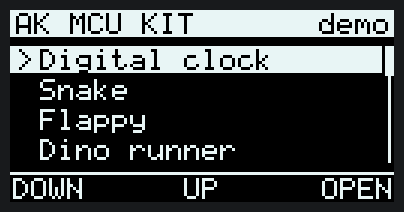

| Snake | Flappy | Đồng hồ qua nửa đêm |
|---|---|---|
|  | 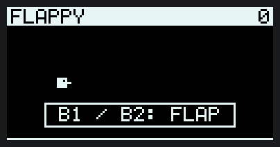 |  |
| **Dino runner** | **Khối 3D** | **Máy hát** |
| 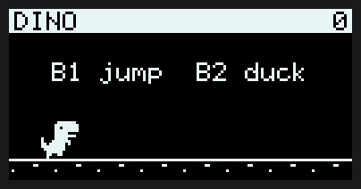 | 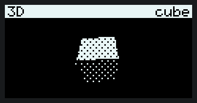 |  |
| **Tetris** | **Breakout** | **Invaders** |
| 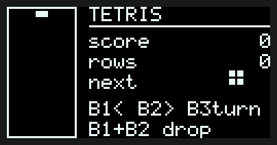 | 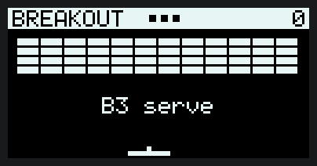 | 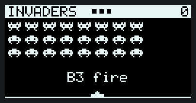 |
| **Pong qua RS485** | | |
| 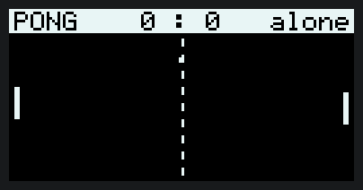 | | |
| **Máy hiện sóng** | | |
| 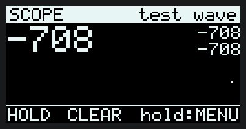 | | |
| **Mê cung 3D** | **Trạm thời tiết** | **Video từ flash SPI** |
| 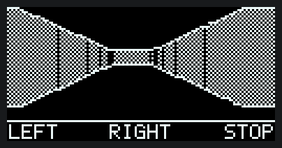 | 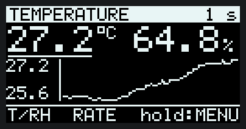 | 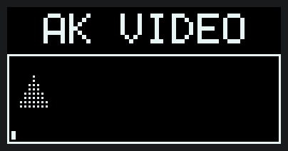 |

Các ảnh động trên **không phải ảnh chụp**: `tests/test_demo.c` chạy đúng mã vẽ và mã game của firmware trên máy tính,
ghi lại từng khung, rồi `tools/demo_gif.py` dựng thành GIF. **Màn hình chờ** (Game of Life, trường sao, plasma):

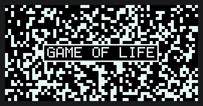

Trong ảnh, các game và mê cung đang ở chế độ tự chơi. Máy hát phát ra còi của kit nên ảnh động không có tiếng.
Số liệu thời tiết và clip trong ảnh là dữ liệu giả lập của bộ test, không phải số đo thật.
Ảnh tĩnh của mọi màn hình: [demo-screens.png](demo-screens.png).

Dựng lại ảnh sau khi sửa mã:

```bash
cmake -S . -B build/host && cmake --build build/host --target test_demo
mkdir -p build/rec && build/host/test_demo build/rec record
python tools/demo_gif.py build/rec docs
```

## Build và nạp

```bash
pio run -e demo -t upload
```

Hoặc cập nhật qua UART khi kit đang chạy `ak-mcu-base`:

```bash
python tools/ak_fw.py --port COMx flash .pio/build/demo/app.img
```

## Cách bấm

Ba nút dưới màn hình, từ trái sang phải: B1, B2, B3. Dòng cuối màn hình ghi chức năng ngay trên từng nút.

| Màn hình | B1 | B2 | B3 bấm | B3 giữ |
|---|---|---|---|---|
| Menu | Xuống | Lên | Mở | — |
| Đồng hồ | Chọn giờ / phút để chỉnh | +1 | — | Về menu |
| Snake | Rẽ trái | Rẽ phải | Tạm dừng | Về menu |
| Flappy | Vỗ cánh | Vỗ cánh | — | Về menu |
| Dino | Nhảy | Cúi (giữ nút) | — | Về menu |
| Tetris | Sang trái | Sang phải | Xoay | Về menu |
| Breakout | Sang trái (giữ) | Sang phải (giữ) | Phát bóng | Về menu |
| Invaders | Sang trái (giữ) | Sang phải (giữ) | Bắn | Về menu |
| Pong RS485 | Lên (giữ) | Xuống (giữ) | — | Về menu |
| Khối 3D | Đổi khối | Tốc độ quay | Khung dây / tô bóng | Về menu |
| Mê cung 3D | Quay trái | Quay phải | Đi / dừng | Về menu |
| Máy hát | Bài kế | Phát / dừng | — | Về menu |
| Video | Tạm dừng / phát | Về đầu clip | — | Về menu |
| Trạm thời tiết | Đồ thị nhiệt độ / độ ẩm | Đổi nhịp lấy mẫu | — | Về menu |
| Máy hiện sóng | Giữ hình / chạy tiếp | Xoá | — | Về menu |
| Màn hình chờ | Hiệu ứng kế | Life: gieo lại · sao: tốc độ · plasma: độ mịn | — | Về menu |
| Hệ thống | Bíp | — | — | Về menu |

- **Đồng hồ** lấy giờ từ RTC PCF85063 của kit; không thấy RTC thì tự đếm từ tick 1 ms (góc phải ghi `RTC` hoặc `soft`).
- **Snake** nhanh dần theo điểm. Rẽ trái/phải tính theo hướng con rắn đang đi.
- **Dino** nhanh dần theo điểm; chim chỉ xuất hiện sau 120 điểm và phải cúi mới qua được.
- **Tetris**: giữ B1 hoặc B2 thì khối đi tiếp; giữ **cả B1 và B2** để thả nhanh. Cứ 8 hàng thì rơi nhanh hơn.
  Giếng 10×20 ô, mỗi ô 3 điểm ảnh, nên hình nhỏ; đó là cái giá của màn hình nằm ngang cao 64 điểm.
- **Breakout**: bóng chạm càng xa giữa thanh đỡ thì bật ra càng xiên. Hết gạch là sang màn mới, bóng nhanh hơn.
- **Invaders**: mỗi lúc chỉ một viên đạn; còn càng ít quái thì chúng đi càng nhanh; mỗi đợt mới bắt đầu thấp hơn.
  B3 bắn khi nhả nút (giữ B3 là về menu).
- **Màn hình chờ**: Game of Life tự gieo lại khi chết hết hoặc đứng yên.
- **Khối 3D** có lập phương, bát diện và kim tự tháp. Chip không có FPU nên mọi phép tính là số nguyên (bảng sin 256 mục);
  màn hình 1 bit nên độ sáng từng mặt được giả bằng dither 4×4.
- **Máy hát** có 6 bài, đều là nhạc dân gian hoặc đã hết bản quyền từ lâu, viết bằng chuỗi RTTTL trong `demo/scr_music.c`.
  Rời màn hình là nhạc dừng.
- **Mê cung 3D** vẽ bằng ray casting: mỗi cột màn hình bắn một tia qua lưới bản đồ, khoảng cách tới tường cho ra chiều cao
  lát tường. Bấm hoặc giữ B1/B2 để quay, B3 để đi; tới cửa có sọc là xong, màn hình báo số giây.
- **Video** phát clip nằm trong flash SPI, lặp lại khi hết. Chưa nạp clip thì màn hình nhắc cách nạp (xem mục dưới).
- **Trạm thời tiết** cần một mô-đun SHT45 cắm vào cổng I2C (J7 hoặc J9); cảm biến này không nằm trên bo. Nó đọc SHT45 mỗi giây, kể cả khi đang mở màn hình khác. Đồ thị có 96 điểm; B2 chọn mỗi điểm cách nhau
  1 giây, 1 phút hoặc 15 phút (96 điểm × 15 phút = 24 giờ). Đổi nhịp là xoá đồ thị. Số liệu nằm trong RAM, mất khi reset.
- **Hệ thống** hiện uptime, mức dùng pool message, RAM chưa từng dùng, số bản ghi sự cố, thời gian vẽ khung trước.

## Pong qua RS485: hai kit, hoặc một kit với máy tính

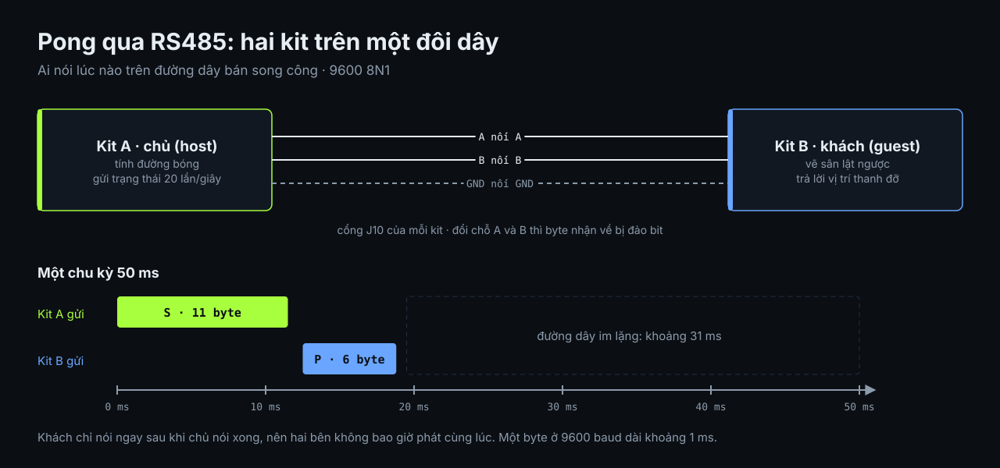

Nối A với A, B với B giữa hai kit, mở **Pong RS485** trên cả hai. Trong vòng một giây hai kit nhận ra nhau:
góc phải thanh tiêu đề đổi từ `alone` sang `host` hoặc `guest`, và ván mới bắt đầu. Thanh đỡ của mình luôn ở bên trái.

- Kit có số ngẫu nhiên lớn hơn làm chủ (`host`): nó tính đường bóng và gửi trạng thái 20 lần/giây. Kit kia (`guest`)
  trả lời ngay sau mỗi khung bằng vị trí thanh đỡ của nó, nên hai bên không bao giờ nói cùng lúc trên đường dây bán song công.
- Mất liên lạc quá một giây thì mỗi kit quay về chơi một mình với máy.
- Khi màn hình Pong đang mở, cổng RS485 thuộc về trò chơi: Modbus slave không trả lời. Rời màn hình là Modbus chạy lại.
- Tốc độ 9600 8N1 như Modbus. Khung truyền mô tả trong `demo/scr_pong.c`.

Chỉ có một kit thì cho máy tính làm kit thứ hai qua bộ USB-RS485:

```bash
python tools/pong_peer.py --port COMx            # máy tính làm guest, kit tính đường bóng
python tools/pong_peer.py --port COMx --host     # máy tính làm host, kit làm guest
```

Đã thử theo cách này ở cả hai vai. **Chưa thử với hai kit thật**, vì lúc viết chỉ có một kit.

## Máy hiện sóng mini: vẽ số liệu gửi tới kit

Mở **Scope** trên kit rồi gửi số, mỗi số là một điểm của đồ thị (số nguyên có dấu 16 bit):

- qua console: gõ `plot 123`, hoặc để chương trình khác in ra các dòng `plot <số>`;
- qua Modbus: ghi thanh ghi holding **16** của kit (địa chỉ 1, 9600 8N1).

```bash
python tools/ak_plot.py --port COMx sine                  # sóng sin qua UART console
python tools/ak_plot.py --port COMy --rs485 noise         # qua RS485, bằng Modbus
chuong_trinh_do | python tools/ak_plot.py --port COMx stdin   # mỗi dòng một số
```

Đồ thị giữ 120 điểm mới nhất và tự co giãn theo giá trị lớn nhất, nhỏ nhất đang hiện; góc phải thanh tiêu đề ghi số điểm
nhận được mỗi giây. Đã thử trên kit: 20 điểm/giây qua UART, 10 điểm/giây qua Modbus, không mất điểm nào.
Đây là công cụ xem xu hướng, không phải máy hiện sóng đo tín hiệu điện: kit không lấy mẫu ADC ở đây.

## Chạy trên trình duyệt

<https://hohoanganh.github.io/ak-mcu-base/play/> là chính firmware này (kernel, shell, Modbus slave, mọi màn hình) biên dịch sang WebAssembly.
Khác với kit: nhiệt độ, độ ẩm là số giả; đồng hồ lấy giờ máy tính; flash nằm trong bộ nhớ.

- Vừa mở trang, kit tự đi một vòng qua các màn hình cho tới khi bạn bấm nút. Hàng ô bên dưới kit mở thẳng từng màn hình,
  và `play/?screen=tetris` là link tới thẳng một màn hình (tên như lệnh `ui open`).
- [Hai kit chơi Pong](https://hohoanganh.github.io/ak-mcu-base/play/pong.html): hai bản firmware cạnh nhau, nối bằng đường RS485 giả lập.
- Muốn nhúng một kit vào trang khác: nạp `ak-kit.js` và `kit-ui.js` rồi gọi `AkKitUI.create(phần_tử)`.

Dựng lại (cần [Emscripten SDK](https://emscripten.org)):

```bash
python src/port/web/build.py        # ghi ra docs/play/ ở gốc repo
```

Mã nguồn nằm ở `port/web/`: `web_main.c` thay cho bo mạch (`demo/kit.h`), `kit-ui.js` là một kit trên trang web,
`index.html` và `pong.html` là hai trang, `clip.akv` là clip mẫu.

## Xem màn hình kit trên máy tính

```bash
python tools/ak_screen.py --port COMx shot man-hinh.png         # chụp một ảnh
python tools/ak_screen.py --port COMx record clip.gif -t 20     # quay 20 giây thành GIF
python tools/ak_screen.py --port COMx live                      # cửa sổ xem trực tiếp
```

Trong cửa sổ `live`: phím `1` `2` `3` là ba nút, `b` là giữ B3 (về menu), `a` bật/tắt tự chơi, `s` lưu ảnh, `q` thoát.

- Kit gửi các trang màn hình **đã đổi** qua cổng console dưới dạng dòng chữ (`@P<trang> <hex> <crc>`), nén PackBits.
  Shell vẫn dùng được trong lúc đó. Lệnh gốc: `ui dump` (một lần), `ui stream` (bật/tắt).
- Ảnh nhận được là bộ đệm khung của firmware, tức đúng thứ firmware đã vẽ, không phải ảnh chụp tấm OLED.
- Số đo: 19 hình/giây với màn hình ít đổi; khoảng 9,5 hình/giây khi cả màn hình đổi liên tục, vì 115200 baud không
  tải nổi nhiều hơn. Lúc đang truyền, các màn hình nặng trên kit cũng chậm đi một chút.

## Nạp video vào kit

Clip nằm ở nửa đầu của flash SPI, cạnh vùng chờ OTA:


Clip nằm ở 512 KB đầu của flash SPI (phần còn lại dành cho OTA). Tool `tools/ak_video.py` chuyển và nạp:

```bash
python tools/ak_video.py convert clip.mp4 -o clip.akv --fps 15     # video; cần opencv-python
python tools/ak_video.py convert anim.gif -o clip.akv              # GIF hoặc thư mục ảnh
python tools/ak_video.py preview clip.akv xem-truoc.gif            # kit sẽ hiện đúng như GIF này
python tools/ak_video.py upload --port COMx clip.akv               # kit đang chạy bản demo
```

- Ảnh được co về 128×64 rồi chuyển đen trắng theo ngưỡng (`--threshold`), hoặc `--dither`. Video dạng bóng đen trắng
  nén tốt nhất; `--dither` cho file lớn hơn nhiều.
- Mỗi khung chỉ lưu những trang màn hình đã đổi, nén PackBits, và chọn lưu nguyên trang hoặc phần khác với khung trước,
  cái nào ngắn hơn. Định dạng ghi trong `demo/video.h`.
- Số đo: clip thử 20 giây, 15 khung/giây chiếm 57 KB (189 byte mỗi khung), nạp mất 8 giây. `convert` báo lỗi nếu clip
  vượt 512 KB; khi đó giảm `--fps` hoặc cắt bằng `--start`, `--duration`.
- Clip mẫu `port/web/clip.akv` là logo AK Foundation xoay 3D (logo thuộc về AK Foundation); bản chạy trên trình duyệt
  phát sẵn clip này. Muốn phát Bad Apple hay phim khác thì tự chuẩn bị file video; lưu ý bản quyền của video đó nếu định
  đăng lại.

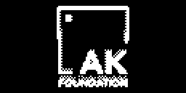

Tự làm clip logo xoay từ một ảnh bất kỳ trên nền trơn:

```bash
python tools/spin_clip.py logo.png -o clip.akv --preview xem-truoc.gif
python tools/ak_video.py upload --port COMx clip.akv
```

`spin_clip.py` dựng ảnh thành một tấm có bề dày quay quanh trục đứng: mặt trước trắng, cạnh bên tô dither để thấy chiều sâu
trên màn hình 1 bit. Các tham số `--turn`, `--hold`, `--tilt`, `--thickness`, `--size` chỉnh tốc độ và dáng quay.

## Kit làm dụng cụ đo trên bàn: I2C, SPI, nRF24

Ba lệnh shell biến kit thành dụng cụ soi một mạch khác. Chúng sinh ra khi dò giao thức của một thiết bị không có tài
liệu: hỏi xem trên bus có gì, nghe hai con chip nói gì với nhau, rồi nghe sóng.

| Lệnh | Làm gì | Có trong |
|---|---|---|
| `i2c` | Quét cổng I2C1 (J7, J9), đọc thanh ghi | mọi bản demo |
| `spi` | Bắt gói SPI trên các chân của J6 | `pio run -e kit_tools` |
| `rf` | Nghe và phát bằng mô-đun nRF24L01+ cắm ở J6 | `pio run -e kit_tools` |

Bản `kit_tools` là bản demo cộng hai công cụ sau. Chúng tách riêng vì bộ đệm bắt SPI chiếm 5,6 KB trong 16 KB RAM
(bản demo dùng 7,6 KB, bản `kit_tools` 12,3 KB).

### `i2c`: trên bus có gì

```
> i2c                    quét địa chỉ 0x08..0x77, in những địa chỉ có trả lời
0x44 0x51
2 device(s)
> i2c 51 4 7             đọc 7 byte từ thanh ghi 0x04 của thiết bị 0x51 (số hex, tối đa 16 byte)
0x51[0x04]: 12 34 08 07 03 10 26
> i2c w                  thả hai dây rồi lấy mẫu: mỗi dây ở mức cao bao nhiêu phần trăm, đổi mức bao nhiêu lần
```

`i2c w` dùng khi quét không ra gì: dây nào nằm ở mức thấp là thiếu trở kéo lên hoặc bị giữ; có cạnh nghĩa là trên bus
đang có một master khác.

### `spi`: nghe hai con chip nói chuyện

SPI1 của kit thành slave chỉ nhận trên J6: NSS ở PA4, SCK ở PA5, dữ liệu ở PA7. Mỗi lần NSS xuống thấp là một khung
mới; kit lưu từng byte kèm khoảng cách thời gian giữa các khung, tối đa 2560 byte và 512 khung.

```
> spi w                  chưa biết dây nào là dây nào: đếm cạnh trên PA4, PA5, PA7 (spi wu / spi wd: kéo lên / kéo xuống)
> spi start 0            bắt đầu bắt, mode 0..3 = CPOL*2 + CPHA; thêm một byte hex để chỉ bắt từ khung mở đầu bằng byte đó
> spi                    đang bật hay tắt, đã bắt bao nhiêu byte, bao nhiêu khung
> spi dump 0             in 24 khung từ khung 0: số thứ tự, cách khung trước bao nhiêu µs, độ dài, các byte
> spi stop               trả SPI1 lại cho flash
```

Trong lúc bắt, flash SPI của kit rời khỏi bus: không cập nhật firmware và không mở màn hình Video cho tới khi `spi stop`.
Khoảng cách thời gian đếm bằng 16 bit nên quay vòng sau 0,5 giây: khoảng nghỉ dài hơn thế hiện ra ngắn.

### `rf`: nghe sóng 2,4 GHz

Cần mô-đun nRF24L01+ ở J6. Mã viết trên kit có CSN của mô-đun ở PB9; kit 3.0 theo schematic đặt CSN ở PA4, khi đó
build thêm `-DRF_CSN_PORT=GPIOA -DRF_CSN_PIN=GPIO_Pin_4`.

```
> rf                     đọc các thanh ghi của mô-đun: có mô-đun hay không
> rf 40 1                nghe kênh 40 (2440 MHz) ở 1 Mbps trong 1,5 giây, in từng gói kèm thời điểm
> rf 40 2 2              2 Mbps, Enhanced ShockBurst, CRC 2 byte (không ghi số cuối: in thô 32 byte, không kiểm CRC)
```

Chế độ thô in các byte đứng sau địa chỉ đúng như trên sóng (trường điều khiển, dữ liệu và CRC của bên phát, không căn
theo byte): dùng nó khi chưa biết bên phát đóng gói thế nào. Tập tin còn các lệnh con `rf t…` phát lại khung kiểu
HS6200 cho một thiết bị cụ thể đã dò; chúng là ví dụ về cách dựng khung bằng tay, không phải lệnh dùng chung.

Mỗi lần nghe dài 1,5 giây rồi trả về, vì một handler chạy quá 3 giây bị `task_system` coi là treo.

### Bản build `remote`: kit 2.1 làm tay điều khiển thử nghiệm

`pio run -e remote` dựng một bản riêng cho **AK Base Kit 2.1** (STM32L151C8 64K, nRF24L01+ và OLED 0,96" SSD1306 trên
bo): menu trên OLED và ba nút chọn nội dung gói điều khiển, nRF24 phát nó liên tục, 8 ms một gói. Đây là dụng cụ thử
từng lệnh cho thiết bị đã dò ở mục `rf` (một drone đồ chơi 2,4 GHz), không phải tay lái: mỗi mục menu đổi một trường
hoặc một bit của gói 13 byte, để nhìn thiết bị phản ứng với từng thứ một. Mã ở `src/remote/` và phần phát trong
`src/port/stm32l151/rf_test.c`.

| Nút | Việc |
|---|---|
| 1 | Mục kế tiếp |
| 2 | Mục trước |
| 3, bấm | Thực hiện mục đang chọn (bật/tắt, cộng, đổi) |
| 3, giữ 0,7 s | Ga về `00` ngay, bíp dài |

Mục đầu là `LINK`: OFF → phát gói ghép cặp 0,4 s rồi gói điều khiển liên tục; bấm lần nữa thì ngừng phát. Radio luôn
tắt lúc bật nguồn. Lệnh shell `rc` bấm nút và xem trạng thái từ máy tính: `rc`, `rc 1|2|3|h`, `rc go <n>`, `rc dump`
(màn hình dạng chữ), `rc lcd` (dò bus màn hình khi màn hình tối).

Một chương trình trên máy tính có thể lái thay ba nút, qua ba lệnh nữa:

| Lệnh | Việc |
|---|---|
| `rc on`, `rc off` | Bật / tắt phát. Khác mục `LINK`: không đảo trạng thái, gọi lặp lại không sao |
| `rc p <13 byte hex>` | Đặt cả gói (byte 0 bị bỏ qua). Gửi đều đặn, ví dụ 20 lần mỗi giây |
| `rc wd <ms>` | Bộ canh: đang phát mà quá `<ms>` không có `rc p` thì gói tự về ga `00`, hai cần ở giữa, bíp dài, cho tới `rc p` kế tiếp. `0` là tắt (mặc định) |

Dòng trạng thái của `rc` có thêm `wd <ms> lost <0|1>`. Khi máy tính gửi gói dồn dập, màn hình chỉ vẽ lại tối đa
150 ms một lần để không làm trễ nhịp phát 8 ms.

Ba điều riêng của bản này:

- **Không có màn hình demo.** Chip 64K chỉ còn 52K cho app sau bootloader; bản này dùng 29K.
- **OLED SSD1306 cần bật bơm điện áp** (`-DKIT_LCD_SSD1306`), khác SSD1309 của kit 3.0. Thiếu thì màn hình vẫn trả
  lời trên bus nhưng tối. Màn hình SH1106 thì thêm `-DKIT_LCD_COL_OFFSET=2`.
- **`LINK` phải OFF khi nạp firmware qua console**: nRF24 và flash SPI (vùng chờ cài) dùng chung SPI1.

Đã chạy trên kit 2.1 thật: màn hình lên, thiết bị nhận ghép cặp và đọc đúng gói. Ba nút mới được bấm qua lệnh `rc`,
chưa bấm tay. Mã và bảng kênh của bộ phát đang ghi cứng theo một bộ tay điều khiển cụ thể.

## Điều khiển qua shell

Không cần đứng cạnh kit vẫn thử được:

```
> ui
display ok, screen: Snake, last frame 20 ms, 3 of 8 pages sent, buttons 0x00
> ui 1        (bấm B1; ui 2, ui 3 tương tự)
> ui back     (giữ B3: về menu)
> ui open tetris   (mở thẳng một màn hình theo một phần tên trong menu; ui open menu để về menu)
> ui auto     (bật/tắt tự chơi: mở một game thì game tự chạy, mở máy hát thì phát lần lượt; bấm nút để giành lại quyền điều khiển)
> th          (nhiệt độ, độ ẩm hiện tại; th csv in thêm cả đồ thị dạng CSV)
> ui dump     (gửi màn hình hiện tại một lần; ui stream: gửi mỗi khi đổi, gõ lần nữa để tắt)
29.3 C, 65.1 %RH, 37 samples, one every 1 s
```

## Demo này cho thấy gì ở base

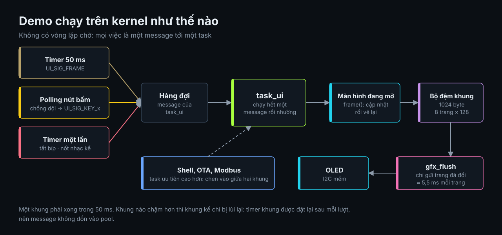

| Việc | Cách làm trên kernel AK |
|---|---|
| Vẽ 20 khung/giây | Timer một lần post `UI_SIG_FRAME` cho `task_ui`, đặt lại sau mỗi khung; không có vòng lặp chờ, khung nào chậm cũng không dồn message |
| Nút bấm | Polling task chống dội rồi post `UI_SIG_KEY_x`; game nhận phím như nhận message |
| Tiếng bíp | Bật còi, đặt timer một lần post `UI_SIG_BEEP_OFF`; không `delay` |
| Đọc cảm biến | Khung này gửi lệnh đo, khung sau mới lấy kết quả: SHT45 cần 8 ms để đo và không ai phải đứng chờ nó |
| Phát video | Tính theo đồng hồ xem lúc này phải tới khung nào rồi giải mã tới đó; đọc flash từng 64 byte, không cần bộ đệm cỡ một khung |
| Nạp file qua UART | Lệnh `0x40`–`0x42` của giao thức nạp firmware được chuyển cho demo qua hàm `ext` của `fw_proto`; ghi xong đọc lại để so |
| Hai kit nói chuyện qua RS485 | Màn hình Pong mượn cổng của Modbus bằng cách tắt polling task của nó (`task_polling_set_ability`), trả lại khi rời màn hình |
| Phát nhạc | `music_step()` bật nốt kế và trả về độ dài; timer một lần post `UI_SIG_NOTE` đúng lúc nốt hết. Không có vòng lặp chờ nên game và shell vẫn chạy |
| Màn hình I2C chậm | Chỉ gửi những trang đã đổi (8 trang × 128 byte): đồng hồ thường gửi 0–2 trang mỗi khung |
| Vẫn phản hồi | Shell, Modbus và OTA chạy song song; `task_ui` ưu tiên thấp hơn chúng |

Số đo trên kit: dựng một khung mất 4–6 ms, mỗi trang gửi ra màn hình mất khoảng 5 ms (I2C bit-bang).
Khối 3D đổi 5 trên 8 trang mỗi khung nên tốn 34–37 ms, vẫn kịp nhịp 50 ms; Dino tối đa 24 ms; mê cung 37 ms (6 trang).
Tetris 20 ms, Breakout 15 ms, Invaders 31 ms. Màn hình chờ đổi cả 8 trang nên mất 45–50 ms (khoảng 19 khung/giây).
Video đổi cả 8 trang thì mất 41–47 ms, tức sát ngân sách: clip 20 khung/giây có cảnh đổi toàn màn hình sẽ bị chậm lại
một chút thay vì bỏ khung. 15 khung/giây là mức an toàn.

Ý tưởng cho các demo tiếp theo (đồng hồ kim, pomodoro, lưới 3D nhiều mặt…), kèm nguồn tham khảo:
[y-tuong-demo.md](y-tuong-demo.md).

## Thêm một màn hình

1. Tạo `demo/scr_ten.c`, khai một `ui_screen_t` với các hàm `enter`, `key`, `frame` và `leave` (để 0 nếu không cần dọn gì khi rời màn hình).
2. Thêm `extern const ui_screen_t scr_ten;` vào `demo/ui.h` và một dòng vào `menu_items[]` trong `demo/ui_common.c`.
3. Trong `frame()`: cập nhật trạng thái, `gfx_clear()`, vẽ lại. Không gọi gì chờ đợi; cần thời gian thì đếm khung.

Mã màn hình không đụng tới chip (`demo/kit.h` là ranh giới), nên thêm một ca trong `tests/test_demo.c` là xem được
ảnh trên máy tính trước khi nạp.

## Phần cứng (AK Base Kit 3I0)

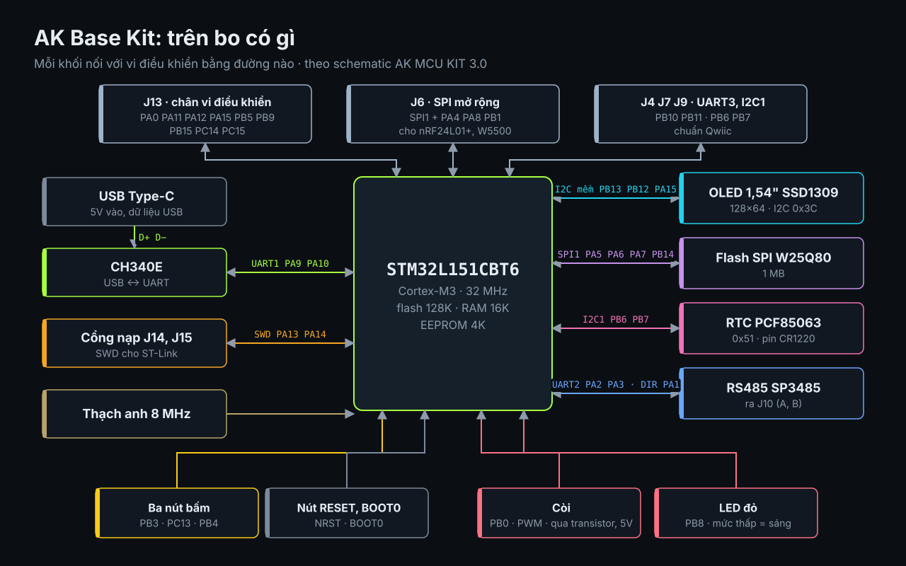

| Kit bản 3 | Sơ đồ mặt trên của bo |
|---|---|
|  |  |

Ảnh và sơ đồ bo: [AK Foundation](https://github.com/the-ak-foundation/ak-base-kit-stm32l151/tree/main/hardware/images) (giấy phép MIT).


Sơ đồ chân sinh bởi `tools/pinout_svg.py`, đã đối chiếu với schematic AK MCU KIT 3.0 (trang MCU, LCD, Connectors) và khớp
với cấu hình trong `port/stm32l151`. Các chân ghi J13, J6 và UART3 ra cổng mở rộng, firmware này chưa dùng.

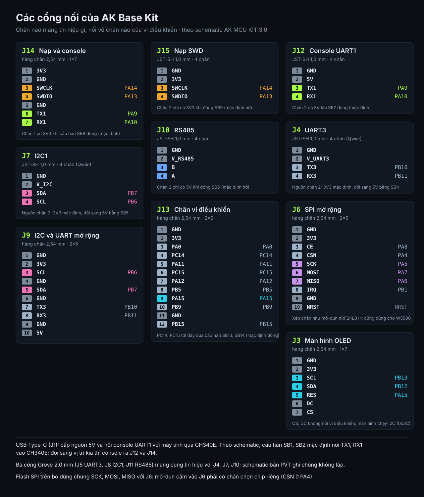

Sơ đồ cổng nối sinh bởi `tools/connectors_svg.py` theo trang Connectors và LCD của schematic.

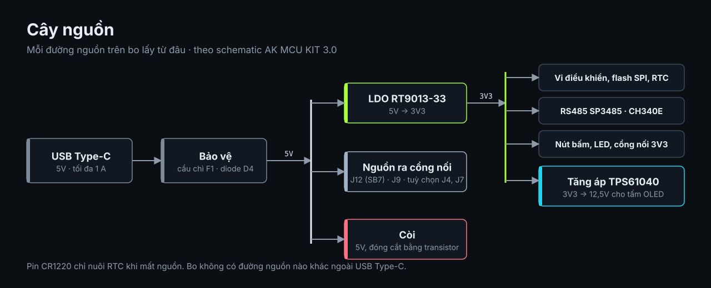

Hai điều schematic cho thấy, firmware đã sửa theo từ v1.3.7:

- **LED đỏ (PB8) sáng khi chân ở mức thấp** (net `LED_DBG_N`). `hal_led_set(1)` giờ kéo chân xuống thấp
  (`PORT_LED_ACTIVE_LOW`, mặc định 1); trước đó "bật" trong firmware là tắt trên bo.
- **Chân chọn chip của mô-đun SPI ở J6 là PA4.** Tuỳ chọn `PORT_KIT_NRF24_CSN` (mặc định tắt) giờ giữ PA4 ở mức cao;
  trước đó nó trỏ PB9 theo kit đời trước.

<details><summary>Bản dựng 3D của bo mạch (không phải ảnh chụp)</summary>

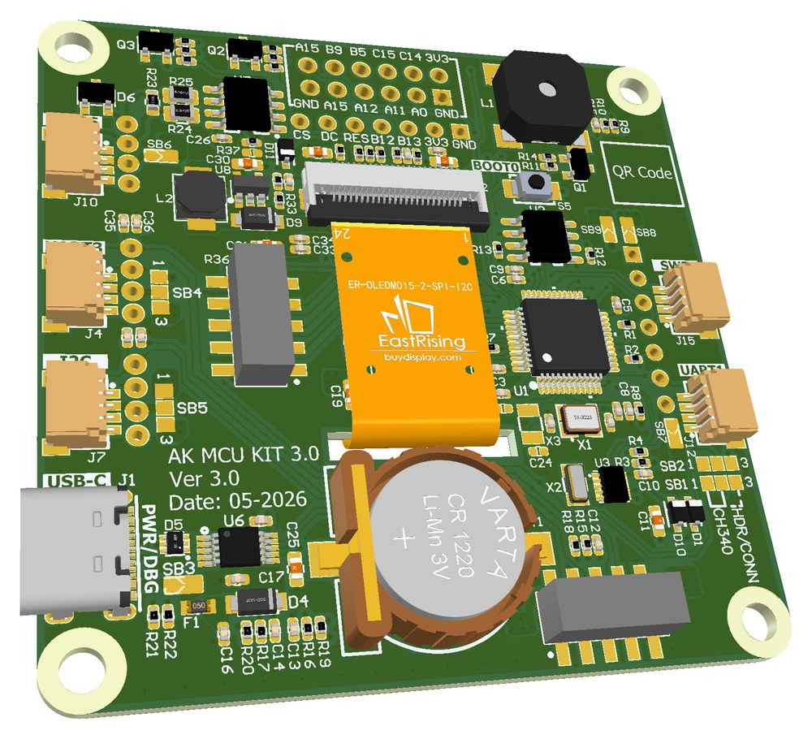

</details>

| Thứ | Chân | Ghi chú |
|---|---|---|
| OLED SSD1309 128×64 | SCL PB13, SDA PB12, RES PA15 | I2C `0x3C`, bit-bang |
| Nút B1, B2, B3 | PB3, PC13, PB4 | Nối GND, kéo lên trong chip |
| Còi | PB0 (TIM3_CH3) | PWM |
| RTC PCF85063 | SCL PB6, SDA PB7 | I2C `0x51`, bit-bang |
| SHT45 (mô-đun cắm ngoài) | SCL PB6, SDA PB7 | I2C `0x44`, cắm vào J7 hoặc J9; không có trong schematic và BOM của bo |
| Flash SPI (W25Q) | SPI1 PA5/PA6/PA7, CS PB14 | 0–512 KB: kho clip của demo; từ 512 KB: vùng chờ của OTA |

PA15, PB3, PB4 là chân JTAG; demo dùng chúng làm GPIO nên JTAG mất, SWD vẫn dùng được.
Driver nằm ở `port/stm32l151/kit.c`. Board khác chỉ cần viết lại file này theo `demo/kit.h`.
