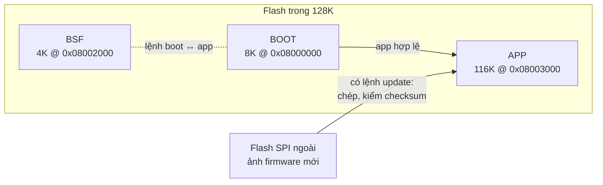

# Base cũ `ak-base-kit-pio` (v1.3.0) — chỉ còn bảo trì

Đây là base firmware đầu tiên của repo: kernel AK, lớp Arduino, driver của AK Base Kit, bootloader 8K + BSF, Modbus
bằng nanoMODBUS, OTA qua RS485. Nó đã dùng cho sản phẩm và vẫn được giữ cho **các dự án đang chạy trên nó**.

**Dự án mới bắt đầu từ base ở [gốc repo](../README.md)** (`ak-mcu-base`). Khác nhau ở đâu:
[so-voi-base-cu.md](../docs/so-voi-base-cu.md).

Đến 07/10/2026 các thư mục ở đây (`sources/`, `release/`, `platformio.ini`…) nằm ở gốc repo. Chúng được chuyển nguyên
vẹn vào `legacy/`; đường dẫn tương đối bên trong không đổi, chỉ cần `cd legacy` trước khi build. Tag `v1.0.0` … `v1.3.0`
vẫn mang cấu trúc cũ, nên dự án clone theo tag không bị ảnh hưởng. Lịch sử thay đổi: [CHANGELOG.md](../CHANGELOG.md).

## Bộ nhớ và kiến trúc



```
┌──────────────────────────────────────────────────────────────────┐
│ APP TASKS   task_system · task_fw · task_shell · task_life ·     │
│             task_if · task_uart_if · task_dbg · task_display     │
├───────────────────────────────┬──────────────────────────────────┤
│ AK KERNEL   scheduler ·       │ NETWORKS/LIBS  nanoMODBUS        │
│ message · timer · fsm/tsm     │ net/link UART · ArduinoJson · QR │
├───────────────────────────────┼──────────────────────────────────┤
│ DRIVERS     button · buzzer · │ COMMON   xprintf · cmd_line ·    │
│ eeprom · flash · led · OLED   │ fifo / ring_buffer · view        │
├───────────────────────────────┴──────────────────────────────────┤
│ PLATFORM    startup/vector · io_cfg/sys_cfg · Arduino core ·     │
│             SPL StdPeriph + CMSIS · ak.ld                        │
├──────────────────────────────────────────────────────────────────┤
│ HW          STM32L151CBT6 (M3 · 32MHz · 128K/16K) + ext flash    │
└──────────────────────────────────────────────────────────────────┘
```

Luồng chạy đầy đủ (bootloader, kernel, timer, bảng ưu tiên task):
[docs/ak-base-kit-pio-luong-hoat-dong.md](docs/ak-base-kit-pio-luong-hoat-dong.md).

## Bắt đầu nhanh

Cần PlatformIO và ST-Link. Board trắng phải nạp cả boot lẫn app.

```bash
cd legacy
pio run -e boot -t upload      # 1. bootloader
pio run -e app  -t upload      # 2. app (Modbus master, mặc định)
pio device monitor             # console UART1, 115200
```

Biến thể Modbus slave để cập nhật qua RS485: `pio run -e app_mbslave`.
File `.bin` thành phẩm nằm ở `release/`; `.bin` và `.elf` của mọi bản tải ở
[Releases](https://github.com/hohoanganh/ak-mcu-base/releases).

## Tôi muốn…

| Việc | Đọc |
|---|---|
| Tạo dự án mới từ base này | [docs/bat-dau-du-an-moi.md](docs/bat-dau-du-an-moi.md) — 7 bước, build, phát hành, các bẫy |
| Hiểu kernel AK, viết task, port chip khác | [docs/huong-dan-su-dung-source-base.md](docs/huong-dan-su-dung-source-base.md) |
| Cập nhật firmware qua RS485, không cần ST-Link | [docs/ota-rs485.md](docs/ota-rs485.md) — bảng thanh ghi, lệnh, tool có giao diện |
| Biết bản nào sửa lỗi gì | [CHANGELOG.md](../CHANGELOG.md) · [docs/known-bugs.md](docs/known-bugs.md) |
| Xem tính năng Modbus mới (v1.2 – v1.3) | [docs/tinh-nang-moi-v1.2-v1.3.md](docs/tinh-nang-moi-v1.2-v1.3.md) |
| Dùng base mới | [README ở gốc repo](../README.md) |
| Cho AI assistant tra tài liệu kernel AK | [docs/ak-mcp-docs-server.md](../docs/ak-mcp-docs-server.md) — repo có sẵn [.mcp.json](../.mcp.json) |

## Ba điều dễ dính nhất

1. **Dự án mới phải clone theo tag** (`git clone --depth 1 --branch v1.3.0 …`) và ghi version base vào README
   của dự án. Chép tay từ một dự án khác là mất dấu các bản sửa lỗi.
2. **`pio run` ghi đè file cùng version trong `release/`.** Build thử thì tăng version, hoặc
   `git checkout -- release` sau khi build.
3. **Board mang bootloader cũ hơn 0.0.2** phải nạp thêm BSF (`pio run -e app -t bsf`). Thiếu bước này board
   đứng ở vòng chờ nháy LED, nhìn giống hệt board treo.

Các ghi chú còn lại (cờ link bắt buộc, `build_dir` ngoài OneDrive, Zigbee, test host…):
[docs/bat-dau-du-an-moi.md](docs/bat-dau-du-an-moi.md#3-ghi-chú-quan-trọng).

## Cấu trúc thư mục

```
legacy/
├── sources/
│   ├── application/      firmware ứng dụng
│   │   ├── ak/           kernel AK
│   │   ├── app/          task của dự án  ← viết code ở đây
│   │   ├── driver/       button, buzzer, eeprom, flash, led, OLED
│   │   ├── networks/     net/link UART, nanoMODBUS
│   │   └── platform/     io_cfg, sys_cfg, startup, SPL + CMSIS, ak.ld
│   └── boot/             bootloader 8K
├── docs/                 tài liệu của base này
├── release/              firmware thành phẩm (.bin)
├── tools/                tool nạp qua RS485
├── tests_host/           test lớp Modbus trên máy tính
└── platformio.ini        cấu hình build: env app, app_mbslave, boot
```
